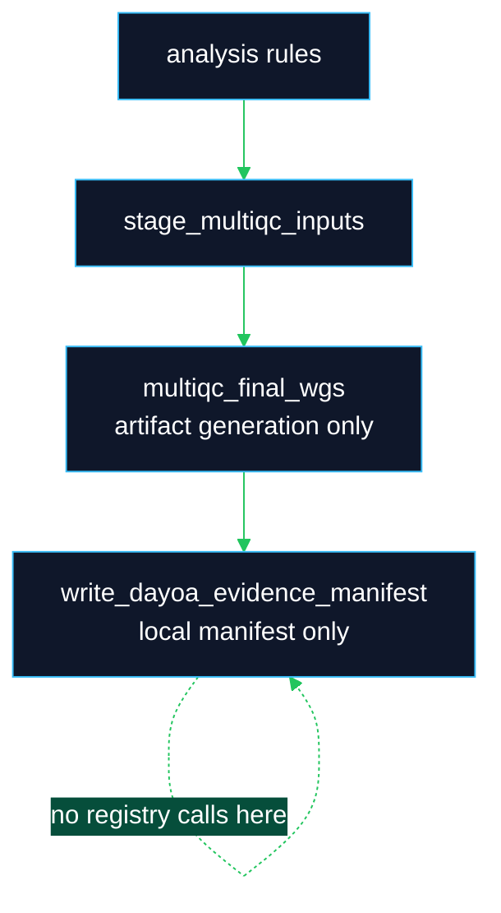

# Daylily Omics Analysis

**Daylily execution requires the broader Daylily ecosystem.** `daylily-omics-analysis` is the Snakemake 7 execution-plane repository. It consumes manifests and staged data prepared by [`daylily-ephemeral-cluster`](https://github.com/Daylily-Informatics/daylily-ephemeral-cluster), runs analysis on prepared AWS ParallelCluster headnodes, and emits evidence. Ursa and Bloom are also key Daylily services: Bloom manages upstream sequencing/run objects, and Ursa brokers operator worksets and DayOA launches. DayOA does not create AWS infrastructure, interpret QC, release results, or own canonical artifact registration.

DayOA produces local evidence and workflow provenance. External orchestration handles artifact registration and downstream evidence import after export.

## What This Repo Owns

| Surface | Responsibility |
|---|---|
| `workflow/Snakefile` and `workflow/rules/` | Snakemake 7 workflow DAG and target aliases. |
| `workflow/scripts/` | Deterministic helpers for staging, validation, MultiQC shaping, and local evidence manifests. |
| `config/samples.tsv` | One row per biological sample or control. Supplied by workset staging. |
| `config/units.tsv` | One row per sequencing unit, lane, read pair, CRAM/BAM, or downsampled unit. Supplied by workset staging. |
| `results/day/<build>/` | Analysis evidence generated by the DAG. |
| `results/runs/<RUNID>/` | Run-context evidence, including run QC and BCL Convert outputs. See `docs/ops/results_directory_structure.md`. |
| `docs/` | Current operator, workflow, evidence, and tool documentation. |
| `quarantine/legacy-docs/` | Historical documentation preserved for provenance, not active guidance. |

DayOA expects references under `/fsx/references` on a configured headnode. Cluster lifecycle, FSx mounts, reference staging, data staging, and production manifest creation belong to `daylily-ephemeral-cluster` and the `daylily-ec` CLI.

## Ecosystem Planes


## Local Smoke Test

On a Mac, activate the `DAY-EC` environment before using this repo:

```bash
eval "$(conda shell.zsh hook)" && conda activate DAY-EC
```

Use a scratch checkout or preserve any existing manifests before copying fixtures:

```bash
mkdir -p config
cp .test_data/data/0.01xwgs_HG002_hg38.samples.tsv config/samples.tsv
cp .test_data/data/0.01xwgs_HG002_hg38.units.tsv config/units.tsv
source dyoainit
dy-a local hg38
dy-r produce_alignstats -n -p -j 1
```

The Mac smoke path validates command wiring and small fixtures. Routine workflows run on a prepared ParallelCluster headnode through SSM and `daylily-ec`.

## Headnode Launch Pattern

Do not use direct SSH, PEM files, or `pcluster ssh` for DayOA headnodes. Use `daylily-ec`/SSM and a login bash shell.

```bash
eval "$(conda shell.zsh hook)" && conda activate DAY-EC
AWS_PROFILE=<profile> daylily-ec headnode connect --profile <profile> --region <region> --cluster <cluster>
exec bash -l
id -un
command -v day-clone
command -v tmux
command -v squeue
```

Launch long workflow work in one persistent tmux session and send `source dyoainit`, `dy-a`, and `dy-r` as separate commands.

## Sentieon License Configuration

Sentieon workflows require `SENTIEON_LICENSE` to point at a valid license file on the headnode. The preferred configuration is explicit in `~/.config/daylily/daylily_cli_global.yaml`:

```yaml
daylily:
  sentieon_lic_path: /fsx/references/runtime_assets/cached_envs/Life_Sciences_Manufacturing_Corporation_eval.lic
```

After initialization and activation, verify the resolved license before launching Sentieon targets:

```bash
source dyoainit
dy-a slurm hg38
test -f "$SENTIEON_LICENSE" && echo "$SENTIEON_LICENSE"
```

If the configured license path is absent, DayOA scans `/fsx/references/runtime_assets/cached_envs/*.lic`. One detected license is assigned to `SENTIEON_LICENSE` with a warning. If multiple licenses are detected, DayOA assigns the file with the longest filename and prints a clear warning that it auto assigned a detected license. If no license is detected, Sentieon tools fail until `sentieon_lic_path` or `SENTIEON_LICENSE` points to a valid file. Do not commit license files to this repository.

## Common Targets

| Target | Purpose |
|---|---|
| `produce_alignstats` | Alignment statistics and `alignstats_combo_mqc.tsv`. |
| `produce_snv_concordances` | Small-variant concordance evidence. |
| `produce_manta_sv_vcf`, `produce_tiddit_sv_vcf`, `produce_dysgu_sv_vcf` | Structural variant evidence. |
| `produce_multiqc_input_data` | Input sequence-data MultiQC. |
| `produce_multiqc_cram` | CRAM/alignment MultiQC. |
| `produce_multiqc_snv`, `produce_multiqc_sv` | Variant-scope MultiQC. |
| `produce_multiqc_all` | Canonical final routine MultiQC aggregation. |
| `produce_dayoa_evidence_manifest` | Deterministic post-MultiQC local evidence manifest. |
| `produce_ont_run_qc` | Mounted ONT run QC plus demux FASTQ QC and focused MultiQC when demux FASTQs are present under `RUN_DIR`. |
| `produce_ultima_run_qc` | Mounted Ultima run QC plus demux FastQC/SeqKit and focused MultiQC when demux FASTQs are present under `RUN_DIR`. |
| `produce_bclconvert_fastqs_and_metrics` | Lane-split Illumina BCL Convert demultiplexing plus generated units and demux metrics. |
| `produce_illumina_run_qc_and_bclconvert` | Mounted Illumina run QC plus lane-split BCL Convert in one run-context workflow. |

## Mounted Run Directories And BCL Convert

Run-directory workflows are designed to read from mounted, read-only FSx DRA paths supplied by `daylily-ephemeral-cluster`. DayOA must not copy full staged run directories into `results/` before analysis. For BCL Convert, the native rule reads the mounted run directory directly and launches one `bcl-convert` job per detected `Data/Intensities/BaseCalls/L###` lane. Each lane job writes lane-local FASTQs and BCL reports under `results/.../bclconvert/lane_fastqs/`. By default `bclconvert.merge_lane_fastqs: false`, so DayOA does not spend time stitching lane FASTQs into one final directory; generated units, metrics, demux FastQC, and MultiQC consume the lane-level `fastq_list.csv` and report files directly. Set `merge_lane_fastqs: true` only when a downstream consumer requires the merged legacy FASTQ/report tree.

After demultiplexing, DayOA prepares collision-safe FastQC input links for every demux FASTQ using identifiers that include run, lane, sample, read group, and read number. The BCL Convert terminal target runs FastQC on those links, fails on identifier collisions, and builds a focused MultiQC report that includes native BCL Convert metrics, custom demux tables, and demux FastQC sections.

The Slurm profile is tuned for solo 192-vCPU BCL runs on `i192mem,i192bigmem`: 16 parallel tiles, 8 conversion threads per tile, 48 compression threads, 8 decompression threads, gzip level 1, shared O_DIRECT output threads enabled, and legacy stats output enabled. The lane sample sheet is generated from the normalized sample sheet and injects `BarcodeMismatchesIndex1,0` and `BarcodeMismatchesIndex2,0` by default. Other BCL Convert sample-sheet settings are wired through config but remain unset unless explicitly configured and tested.

For live validation of the zero-mismatch BCL path, use a `day-clone -d bclconvert_0_mm` workset name so the analysis directory itself records the matching policy.

## Mounted ONT And Ultima Run QC

`produce_ont_run_qc` and `produce_ultima_run_qc` are mounted run-context targets. They require an explicit `config/runs.tsv` row for the platform with `RUN_DIR`, and they fail if demultiplexed FASTQs are not present when the demux QC report is requested. DayOA reads the mounted run directory directly and writes QC outputs under `results/runs/<RUNID>/run_qc/<platform>/`; it does not copy the run folder into `results/`.

ONT demux QC groups FASTQs by containing directory and runs SeqKit, nanoq, NanoStat, NanoPlot, and focused MultiQC. Ultima demux QC groups FASTQs the same way, creates collision-checked symlink inputs, runs FastQC and SeqKit, and builds `ultima_demux_fastq.multiqc.html`.

## Hybrid Ultima And ONT

The modular Ultima+ONT Sentieon hybrid path (`sentdhuomr`) hard-fails on Stage1 driver errors and no longer uses process substitution for HAP and INS streams. Stage1 now runs the Sentieon drivers sequentially into temp SAM files, validates the target haplotype BAM and realigned BAM before downstream rules consume them, and indexes the haplotype BAM only after integrity checks. Stage2, Stage3, and Pass2 also tolerate genuinely empty target/refined-region shards by emitting explicit empty outputs with log messages rather than feeding empty target-hap state into Sentieon.

## MultiQC And Evidence Boundaries

MultiQC HTML is a report, not canonical data. The parser-relevant evidence is in `DAY_final_multiqc_data/`, staged source manifests, custom `_mqc.tsv` files, logs, benchmarks, and the local DayOA evidence manifest.



See [`docs/ops/multiqc_qc_targets.md`](docs/ops/multiqc_qc_targets.md).

## Documentation Map

| Document | Use |
|---|---|
| [`docs/README.md`](docs/README.md) | Active documentation index. |
| [`docs/catalog_of_tools.md`](docs/catalog_of_tools.md) | Tool, rule, output, test, and public-link inventory. |
| [`docs/ops/multiqc_qc_targets.md`](docs/ops/multiqc_qc_targets.md) | MultiQC staging, runtime gating, and local evidence boundaries. |
| [`docs/ops/results_directory_structure.md`](docs/ops/results_directory_structure.md) | Analysis, `results/day`, `results/runs`, run QC, and BCL Convert output layout. |
| [`docs/examples/multiqc/README.md`](docs/examples/multiqc/README.md) | Example MultiQC report handling and cluster-dependent example guidance. |

## Validation

Focused local checks:

```bash
eval "$(conda shell.zsh hook)" && conda activate DAY-EC
python -m pytest -q tests/test_multiqc_qc_targets.py tests/test_multiqc_staging_contracts.py tests/test_multiqc_sample_identifiers.py tests/test_evidence_manifest.py
python -m coverage run -m pytest -q tests
python -m coverage report
```

Cluster examples are valid only after a working headnode is available through `daylily-ec`/SSM with an explicit non-default AWS profile.
