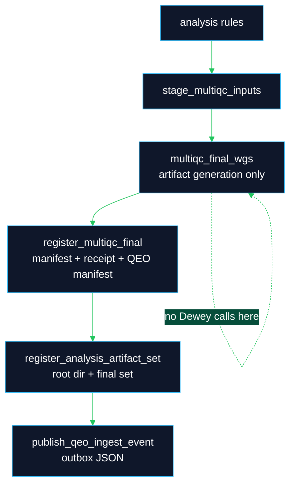

# Daylily Omics Analysis

**Daylily execution requires the broader Daylily ecosystem.** `daylily-omics-analysis` is the Snakemake 7 execution-plane repository. It consumes manifests and staged data prepared by [`daylily-ephemeral-cluster`](https://github.com/Daylily-Informatics/daylily-ephemeral-cluster), runs analysis on prepared AWS ParallelCluster headnodes, and emits evidence. Ursa and Bloom are also key Daylily services: Bloom manages upstream sequencing/run objects, and Ursa brokers operator worksets and DayOA launches. DayOA does not create AWS infrastructure, interpret QC, release results, or own canonical artifact registration.

DayOA produces evidence. Dewey registers evidence. QEO observes evidence. R2 interprets and releases.

## What This Repo Owns

| Surface | Responsibility |
|---|---|
| `workflow/Snakefile` and `workflow/rules/` | Snakemake 7 workflow DAG and target aliases. |
| `workflow/scripts/` | Deterministic helpers for staging, validation, MultiQC shaping, and artifact registration. |
| `config/samples.tsv` | One row per biological sample or control. Supplied by workset staging. |
| `config/units.tsv` | One row per sequencing unit, lane, read pair, CRAM/BAM, or downsampled unit. Supplied by workset staging. |
| `results/day/<build>/` | Analysis evidence generated by the DAG. |
| `docs/` | Current operator, workflow, QEO, and tool documentation. |
| `quarantine/legacy-docs/` | Historical documentation preserved for provenance, not active guidance. |

DayOA expects references under `/fsx/references` on a configured headnode. Cluster lifecycle, FSx mounts, reference staging, data staging, and production manifest creation belong to `daylily-ephemeral-cluster` and the `daylily-ec` CLI.

## Ecosystem Planes

```mermaid
%%{init: {"theme":"base","themeVariables":{"primaryColor":"#101827","primaryTextColor":"#ffffff","primaryBorderColor":"#ef4444","lineColor":"#ef4444","secondaryColor":"#0f766e","tertiaryColor":"#facc15","fontFamily":"Inter,Arial,sans-serif"}}}%%
flowchart LR
  Bloom["Bloom<br/>run and lab objects"]:::svc
  Ursa["Ursa<br/>worksets and launch UX"]:::svc
  EC["daylily-ephemeral-cluster<br/>clusters, FSx, staging"]:::critical
  DayOA["daylily-omics-analysis<br/>execution plane"]:::exec
  Dewey["Dewey<br/>canonical artifact registry"]:::registry
  QEO["QEO/KEO<br/>evidence observation"]:::observe
  R2["R2<br/>QC, disposition, release"]:::release

  Bloom --> Ursa --> EC --> DayOA --> Dewey --> QEO --> R2

  classDef critical fill:#7f1d1d,stroke:#ef4444,color:#fff,stroke-width:3px
  classDef exec fill:#1e293b,stroke:#38bdf8,color:#fff,stroke-width:3px
  classDef registry fill:#14532d,stroke:#22c55e,color:#fff,stroke-width:3px
  classDef observe fill:#312e81,stroke:#a78bfa,color:#fff,stroke-width:3px
  classDef release fill:#713f12,stroke:#facc15,color:#fff,stroke-width:3px
  classDef svc fill:#0f172a,stroke:#94a3b8,color:#fff,stroke-width:2px
```



## Local Smoke Test

On a Mac, activate the `DAY-EC` environment before using this repo:

```bash
eval "$(conda shell.zsh hook)" && conda activate DAY-EC
```

Use a scratch checkout or preserve any existing manifests before copying fixtures:

```bash
mkdir -p config
cp .test_data/data/0.01xwgs_HG002_hg38.samples.tsv config/samples.tsv
cp .test_data/data/0.01xwgs_HG002_hg38.units.tsv config/units.tsv
source dyoainit
dy-a local hg38
dy-r produce_alignstats -n -p -j 1
```

The Mac smoke path validates command wiring and small fixtures. Routine workflows run on a prepared ParallelCluster headnode through SSM and `daylily-ec`.

## Headnode Launch Pattern

Do not use direct SSH, PEM files, or `pcluster ssh` for DayOA headnodes. Use `daylily-ec`/SSM and a login bash shell.

```bash
eval "$(conda shell.zsh hook)" && conda activate DAY-EC
AWS_PROFILE=<profile> daylily-ec headnode connect --profile <profile> --region <region> --cluster <cluster>
exec bash -l
id -un
command -v day-clone
command -v tmux
command -v squeue
```

Launch long workflow work in one persistent tmux session and send `source dyoainit`, `dy-a`, and `dy-r` as separate commands.

## Common Targets

| Target | Purpose |
|---|---|
| `produce_alignstats` | Alignment statistics and `alignstats_combo_mqc.tsv`. |
| `produce_snv_concordances` | Small-variant concordance evidence. |
| `produce_manta_sv_vcf`, `produce_tiddit_sv_vcf`, `produce_dysgu_sv_vcf` | Structural variant evidence. |
| `produce_multiqc_input_data` | Input sequence-data MultiQC. |
| `produce_multiqc_cram` | CRAM/alignment MultiQC. |
| `produce_multiqc_snv`, `produce_multiqc_sv` | Variant-scope MultiQC. |
| `produce_multiqc_all` | Canonical final routine MultiQC aggregation. |
| `produce_qeo_multiqc_registration` | Deterministic post-MultiQC artifact manifest, Dewey receipt, and QEO manifest. |
| `produce_qeo_analysis_artifact_set` | Final analysis artifact-set registration outputs. |
| `produce_qeo_ingest_event` | Replay-safe QEO outbox event after artifact-set registration. |

## MultiQC And QEO Boundaries

MultiQC HTML is a report, not canonical data. The parser-relevant evidence is in `DAY_final_multiqc_data/`, staged source manifests, custom `_mqc.tsv` files, logs, benchmarks, and registered artifact manifests.



See [`docs/ops/multiqc_qc_targets.md`](docs/ops/multiqc_qc_targets.md), [`docs/qeo/QEO_DAYOA_INTEGRATION.md`](docs/qeo/QEO_DAYOA_INTEGRATION.md), and [`docs/qeo/QEO_SNAKEMAKE7_REGISTRATION.md`](docs/qeo/QEO_SNAKEMAKE7_REGISTRATION.md).

## Documentation Map

| Document | Use |
|---|---|
| [`docs/README.md`](docs/README.md) | Active documentation index. |
| [`docs/catalog_of_tools.md`](docs/catalog_of_tools.md) | Tool, rule, output, test, and public-link inventory. |
| [`docs/ops/multiqc_qc_targets.md`](docs/ops/multiqc_qc_targets.md) | MultiQC staging, runtime gating, and QEO registration boundaries. |
| [`docs/qeo/QEO_DAYOA_RECON.md`](docs/qeo/QEO_DAYOA_RECON.md) | Repo-grounded QEO reconnaissance. |
| [`docs/qeo/QEO_MULTIQC_ARTIFACT_MODEL.md`](docs/qeo/QEO_MULTIQC_ARTIFACT_MODEL.md) | MultiQC artifact model and parser semantics. |
| [`docs/qeo/QEO_GOLDEN_CORPUS_TEST_PLAN.md`](docs/qeo/QEO_GOLDEN_CORPUS_TEST_PLAN.md) | Golden corpus and deterministic test plan. |
| [`docs/examples/multiqc/README.md`](docs/examples/multiqc/README.md) | Example MultiQC report handling and cluster-dependent example guidance. |

## Validation

Focused local checks:

```bash
eval "$(conda shell.zsh hook)" && conda activate DAY-EC
python -m pytest -q tests/test_multiqc_qc_targets.py tests/test_multiqc_staging_contracts.py tests/test_multiqc_sample_identifiers.py tests/test_qeo_registration.py
python -m coverage run -m pytest -q tests
python -m coverage report
```

Cluster examples are valid only after a working headnode is available through `daylily-ec`/SSM with an explicit non-default AWS profile.

