# HG003 Multi-Platform Coverage Series — AGBT 2026

> **Sample:** GIAB HG003 (Ashkenazi father, NA24149)
> **Reference:** GRCh38 / hg38 (Ultima: hg38\_broad)
> **Truth set:** GIAB v4.2.1 high-confidence calls
> **Pipeline:** [daylily-omics-analysis](https://github.com/Daylily-Informatics/daylily-omics-analysis) on AWS ParallelCluster
> **Date:** 2026-02-18

---

## 1. Dataset Overview

### Workflows

| Workflow ID | Platform | Instrument | Aligner | SNV Caller | Units | Nominal Coverage Range | Genome Build | Status |
|---|---|---|---|---|---|---|---|---|
| `ilmn_hg003_prod` | Illumina | NovaSeq X | `sentieon_bwa_sort` | `sent_DNAscope` | 9 | 1–40x | hg38 | ✅ Complete |
| `agbt_ont` | ONT | PromethION (R10.4) | `ont` (minimap2) | `sentdont` (DNAscope-LR) | 10 | 1–50x | hg38 | ✅ Complete |
| `pb_hg003_prod` | PacBio | Revio (HiFi) | `sentmm2` | `sentdpb` | 8 | 1–30x | hg38 | ✅ Complete |
| `roche_hg003_coverage_series` | Roche | SBX Duplex | `roche` | `rochehc` (GATK HC) | 9 | 1–40x | hg38 | ✅ Complete |
| `agbt_ug` | Ultima | UG100 | `ug` | `ug` | 10 | 1–50x | hg38\_broad | ✅ Complete |

**Total analysis units:** 46 (across 5 platforms)

### Concordance Assessment

- **Primary footprint:** `giabHC_x_clinvar_genes` — intersection of GIAB high-confidence regions and ClinVar gene bodies
- **Secondary footprint (plots):** `giabHC` — GIAB high-confidence regions only

### SNP Classes Evaluated

| SNP Class | Description |
|---|---|
| `SNPts` | Single-nucleotide transitions (e.g., A↔G, C↔T) |
| `SNPtv` | Single-nucleotide transversions (e.g., A↔C, G↔T) |
| `INS_50` | Insertions ≤ 50 bp |
| `DEL_50` | Deletions ≤ 50 bp |
| `Indel_50` | All indels ≤ 50 bp |

Additional classes in raw data: `All`, `INS_gt50`, `DEL_gt50`, `Indel_gt50`

### Comparison Footprints in Raw Data

Eight footprints are computed per unit: `giabHC`, `giabHC_x_clinvar_genes`, `giabHC_x_ultima`, `giabHC_x_ultima_x_clinvar`, `clinvar_genes`, `hg38`, `hg38_m_giabHC`, `ultima`.

---

## 2. Key Findings

### 2.1 Coverage Accuracy — Measured vs Nominal

Each platform exhibits a characteristic ratio of measured (alignstats `WgsCoverageMean`) to nominal coverage:

| Platform | Measured / Nominal Ratio | Interpretation |
|---|---|---|
| **PacBio** | **1.000** | Near-perfect — HiFi reads map essentially 1:1 |
| **ILMN** | **1.130** | Slight over-estimation from short-read redundancy |
| **Roche** | **1.338** | 34% inflation — duplex consensus reads are shorter/denser after dedup |
| **Ultima** | **0.900** | 10% loss — expected from flow-space chemistry mapping gaps |
| **ONT** | **0.520** | ~48% loss — long-read soft-clipping, chimeric filtering, supplementary alignment discarding |

**Practical implication:** To achieve 30x effective ONT coverage, approximately 60x nominal sequencing is required. Roche's inflation means 22x nominal yields ~30x measured.

### 2.2 SNP Concordance (F-score) by Platform

All platforms converge to > 0.99 F-score for SNPs given sufficient coverage, but trajectories differ:

| Platform | F-score @ 10x nom | F-score @ 20x nom | Plateau F-score | Nominal cov to reach F > 0.99 |
|---|---|---|---|---|
| **ILMN** | 0.9853 | 0.9945 | ~0.996 | ~15x |
| **Roche** | 0.9866 | 0.9912 | ~0.992 | ~10x |
| **PacBio** | 0.9905 | 0.9980 | ~0.999 | ~10x |
| **Ultima** | 0.9589 | 0.9894 | ~0.994 | ~20x |
| **ONT** | 0.9570 | 0.9897 | ~0.998 | ~40x |

PacBio HiFi achieves the highest SNP F-score across all platforms (0.9988 at 30x nominal / 30x measured) with the fastest convergence — reaching F > 0.99 at just 10x nominal. ONT achieves 0.9982 at 50x nominal / 26x measured but requires significantly more raw data.

### 2.3 Indel Concordance — The Primary Platform Differentiator

| Platform | INS\_50 F @ 30x nom | DEL\_50 F @ 30x nom | Gap vs SNPs |
|---|---|---|---|
| **ILMN** | **0.9961** | **0.9969** | < 0.001 |
| **Roche** | **0.9915** | **0.9936** | ~0.002 |
| **PacBio** | **0.9849** | **0.9967** | ~0.014 |
| **Ultima** | 0.9049 | 0.9207 | ~0.08 |
| **ONT** | 0.7077 ⚠️ | 0.7133 ⚠️ | ~0.10 |

PacBio HiFi bridges the gap between short-read and long-read indel performance — achieving 0.985 INS\_50 and 0.997 DEL\_50 at 30x, nearly matching ILMN/Roche. Short-read platforms (ILMN, Roche) achieve > 0.99 indel F-scores by ~15x nominal. ONT and Ultima plateau around 0.91–0.93 even at 50x nominal, reflecting systematic indel-calling limitations in current long-read variant callers rather than coverage insufficiency.

### 2.4 Precision vs Recall Dynamics

- **PacBio** — Best overall trajectory. Both precision and recall rise steeply; by 10x the SNP cluster is already in the top-right corner (> 0.99 × > 0.99). Indel performance is exceptional for a long-read platform — by 30x it nearly matches ILMN.
- **ILMN** — Balanced trajectory; both precision and recall increase together, reaching > 0.995 × > 0.995 by ~15x. Minimal asymmetry across all SNP classes.
- **Roche** — Similar to ILMN but plateaus slightly earlier in precision while recall continues climbing. Very strong indel precision.
- **ONT** — Recall-limited at low coverage; precision starts high. For SNPs the trajectory is steep and reaches near-perfect. For indels, recall saturates ~0.90 — the caller misses ~10% of true indels regardless of depth.
- **Ultima** — Precision-limited compared to recall for SNPs. For indels, both axes are depressed, but recall is the weaker (similar to ONT pattern, less extreme).

### 2.5 Platform-Specific Anomalies

#### ONT 30x Concordance Dip

ONT nominal-30x (measured 15.6x) shows a sharp, isolated concordance drop across **all** SNP classes:

| Metric | ONT 20x nom | ONT 30x nom ⚠️ | ONT 40x nom |
|---|---|---|---|
| SNPts F-score | 0.9897 | **0.8034** | 0.9978 |
| INS\_50 F-score | 0.8445 | **0.7077** | 0.9011 |
| DEL\_50 F-score | 0.8378 | **0.7133** | 0.9068 |

The monotonic coverage–quality relationship breaks only at this single point. The most likely cause is a corrupted or incompletely cleaned input CRAM (`HG003_30x.cleaned.cram`). Investigation recommended: verify read count, CRAM integrity, and the cleaning process.

### 2.6 Per-Unit Cost & Compute Benchmarks

All workflows ran on **m7i.48xlarge** (192 vCPU) spot instances at **~$2.96/hr** in us-west-2d. Costs are reported **per unit** (one sample at one coverage level through the full pipeline). **Roche** benchmark data was not available. **ONT** and **Ultima** benchmarks do not include alignment (pre-aligned input); **ILMN** and **PacBio** include alignment.

#### Cost at key coverage levels (USD)

| Platform | 1x | 5x | 10x | 15x | 20x | 30x | 40x | 50x |
|---|---|---|---|---|---|---|---|---|
| **Ultima** | $0.34 | $0.53 | $0.82 | $1.01 | $1.17 | $1.29 | $1.77 | $2.12 |
| **ONT** | $0.56 | $1.09 | $1.30 | $1.34 | $1.33 | $1.13 | $1.36 | $1.40 |
| **ILMN** | $0.64 | $1.07 | $1.52 | $1.89 | $2.18 | $2.88 | $3.60 | — |
| **PacBio** | $1.20 | $2.09 | $2.25 | $2.50 | $2.79 | $3.32 | — | — |

#### Cost composition patterns

- **ILMN** — Alignment cost scales linearly with coverage ($0.15 at 1x → $1.53 at 40x). Concordance is nearly flat (~$0.52 regardless of coverage). Variant calling is moderate and scales sub-linearly.
- **PacBio** — Variant calling dominates at every coverage level ($0.80 at 1x → $1.76 at 30x). Alignment scales linearly. Concordance is flat (~$0.44).
- **ONT** — Variant calling is the largest cost component but plateaus above ~15x (~$0.89). Concordance is flat (~$0.43). Total cost is remarkably flat across coverage levels ($1.13–$1.40 from 10–50x).
- **Ultima** — Cheapest at every coverage level. Variant calling scales from $0.06 (1x) to $1.49 (50x). Concordance is flat (~$0.49).

**Key insight**: Concordance evaluation cost is **coverage-independent** (~$0.43–$0.53/unit) across all platforms, representing a fixed overhead. The coverage-dependent costs are alignment (ILMN, PacBio only) and variant calling.

---

## 3. Generated Visualizations

All plots are in the `_analysis_data/` directory. Point sizes are proportional to measured coverage. Colorblind-friendly palette: ILMN = blue (`#0072B2`), ONT = vermillion (`#D55E00`), PacBio = teal (`#009E73`), Roche = amber (`#E69F00`), Ultima = pink (`#CC79A7`).

### 3.1 Coverage

- **[all_platforms_coverage_plot.png](all_platforms_coverage_plot.png)** — Measured mean coverage (alignstats) vs nominal coverage for all platforms. Dashed diagonal = 1:1 line.

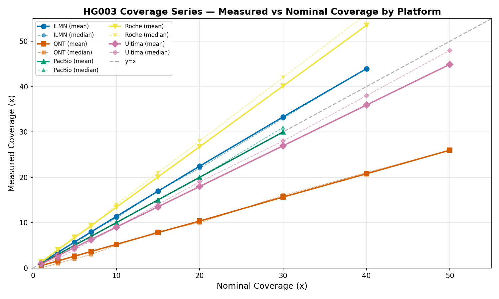

### 3.2 F-score by Nominal Coverage

- **[all_platforms_concordance_plot.png](all_platforms_concordance_plot.png)** — F-score vs nominal coverage, faceted by SNP class (SNPts, SNPtv, INS\_50, DEL\_50, Indel\_50). Primary footprint: `giabHC_x_clinvar_genes`.

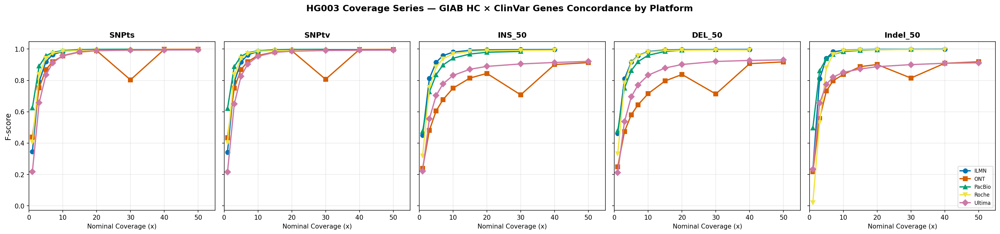

### 3.3 F-score by Measured Coverage

- **[all_platforms_fscore_by_measured_cov.png](all_platforms_fscore_by_measured_cov.png)** — Same as above but X-axis is measured mean coverage from alignstats. Provides a fairer cross-platform comparison since nominal coverage has different effective yields per platform.

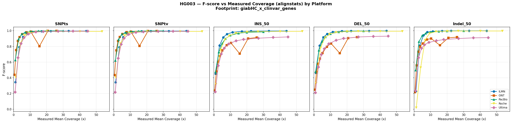

### 3.4 F-score Zoomed Views

- **[all_platforms_fscore_by_measured_cov_zoomed.png](all_platforms_fscore_by_measured_cov_zoomed.png)** — F-score by measured coverage, Y-axis restricted to 0.90–1.00 with 0.01 major gridlines. Low-coverage / low-performing points clipped to highlight high-performance separation.

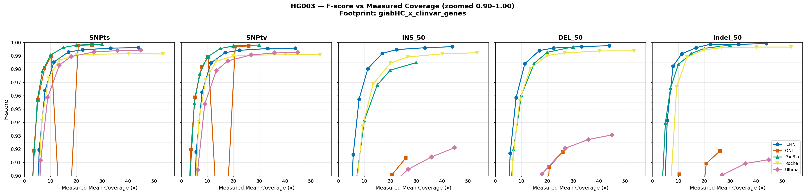

### 3.5 Precision vs Recall (giabHC Footprint)

- **[all_platforms_precision_vs_recall_giabHC.png](all_platforms_precision_vs_recall_giabHC.png)** — Precision vs Recall scatter, faceted by SNP class. Footprint: `giabHC`. Connected lines show coverage trajectory (low → high). Iso-F contour lines at F = 0.90, 0.95, 0.99.

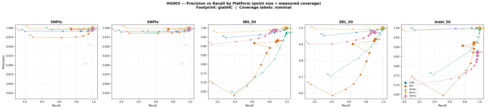

- **[all_platforms_precision_vs_recall_giabHC_zoomed.png](all_platforms_precision_vs_recall_giabHC_zoomed.png)** — Same, axes restricted to 0.95–1.00 for detailed view of high-performing units.

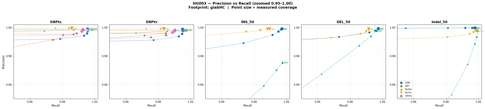

### 3.6 Recall and Precision Faceted Plots

- **[all_platforms_recall_plot.png](all_platforms_recall_plot.png)** — Recall (sensitivity) vs nominal coverage, faceted by SNP class.
- **[all_platforms_precision_plot.png](all_platforms_precision_plot.png)** — Precision (PPV) vs nominal coverage, faceted by SNP class.

### 3.7 Concordance by Footprint

- **[all_platforms_fscore_by_footprint.png](all_platforms_fscore_by_footprint.png)** — F-score by measured coverage across three concordance footprints: `hg38` (whole genome), `giabHC` (GIAB high-confidence regions), and `clinvar_genes`. 3×5 facet grid (rows = footprints, cols = SNP classes).

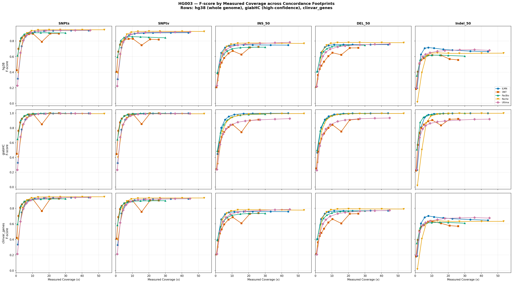

### 3.8 Per-Unit Cost & Wall Time

- **[per_unit_cost_vs_coverage.png](per_unit_cost_vs_coverage.png)** — Total cost (USD) per unit by nominal coverage, one line per platform.

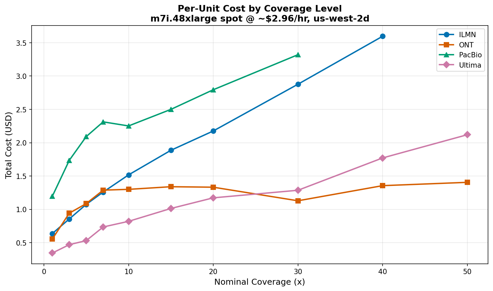

- **[per_unit_walltime_vs_coverage.png](per_unit_walltime_vs_coverage.png)** — Total wall time (minutes) per unit by nominal coverage.

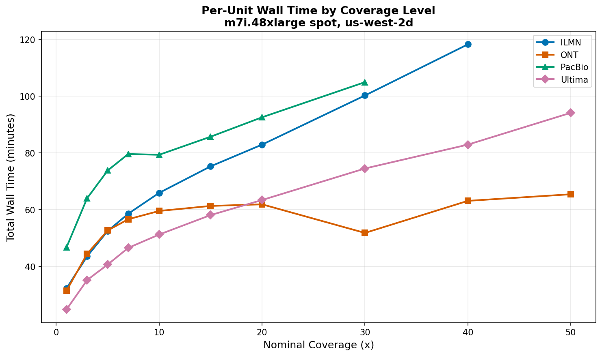

- **[per_unit_cost_by_stage.png](per_unit_cost_by_stage.png)** — Stacked bar: cost breakdown by pipeline stage (alignment, variant calling, concordance, alignstats) for each unit, faceted by platform.

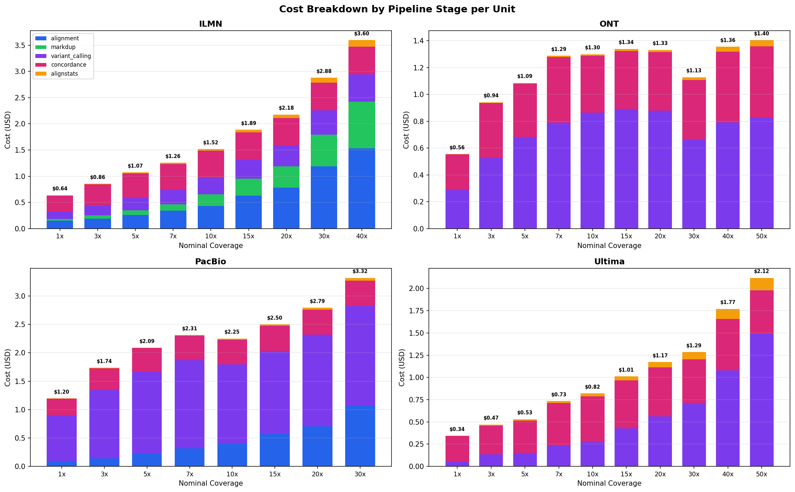

- **[per_unit_walltime_by_stage.png](per_unit_walltime_by_stage.png)** — Stacked bar: wall time breakdown by stage for each unit, faceted by platform.

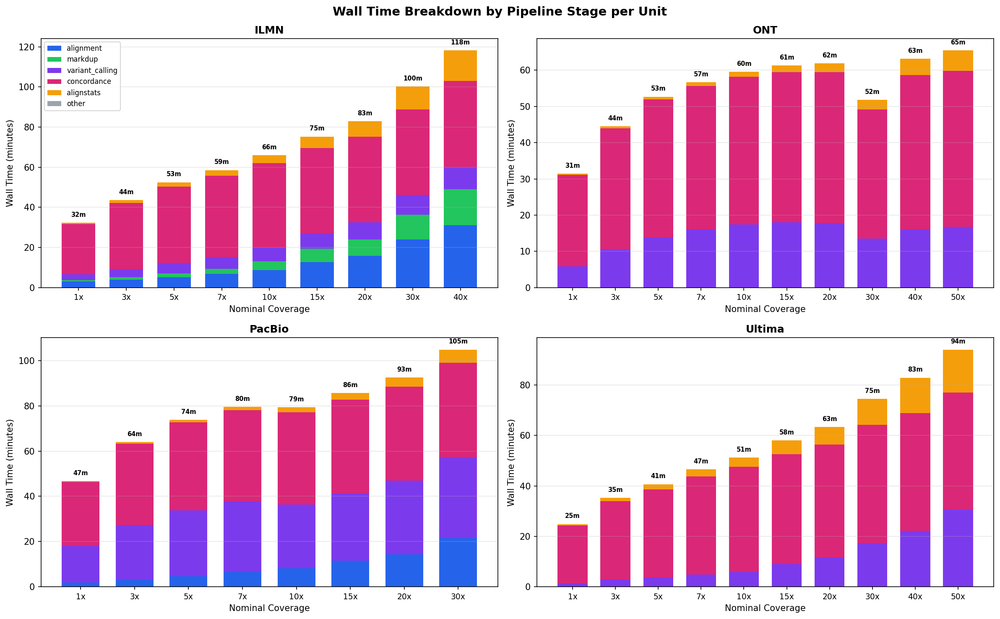

---

## 4. Data Files

### Summary Table

- **[all_platforms_summary.tsv](all_platforms_summary.tsv)** — 46-row table (1 per unit) with columns: `platform`, `sample_base`, `aligner`, `nominal_cov`, `WgsCoverageMean`, `WgsCoverageMedian`, and F-scores for each SNP class (`giabHC_x_clinvar_genes` footprint). All 5 platforms have complete concordance data.
- **[per_unit_benchmarks.tsv](per_unit_benchmarks.tsv)** — 37-row table (1 per unit per platform) with per-unit total cost, wall time, peak RSS, and per-stage cost/walltime breakdown.
- **[per_unit_per_stage_benchmarks.tsv](per_unit_per_stage_benchmarks.tsv)** — 204-row detail table (1 per unit per rule) with stage classification, cost, wall time, CPU efficiency.
- **[platform_benchmarks_summary.tsv](platform_benchmarks_summary.tsv)** — Aggregated platform-level cost summary (legacy).

### Per-Workflow Raw Data

| Workflow | Alignstats | Concordance |
|---|---|---|
| `agbt_ont` | [alignstats_combo_mqc.tsv](agbt_ont/alignstats_combo_mqc.tsv) | [giab_concordance_mqc.tsv](agbt_ont/giab_concordance_mqc.tsv) |
| `agbt_ug` | [alignstats_combo_mqc.tsv](agbt_ug/alignstats_combo_mqc.tsv) | [giab_concordance_mqc.tsv](agbt_ug/giab_concordance_mqc.tsv) |
| `ilmn_hg003_prod` | [alignstats_combo_mqc.tsv](ilmn_hg003_prod/alignstats_combo_mqc.tsv) | [giab_concordance_mqc.tsv](ilmn_hg003_prod/giab_concordance_mqc.tsv) |
| `pb_hg003_prod` | [alignstats_combo_mqc.tsv](pb_hg003_prod/alignstats_combo_mqc.tsv) | [giab_concordance_mqc.tsv](pb_hg003_prod/giab_concordance_mqc.tsv) |
| `roche_hg003_coverage_series` | [alignstats_combo_mqc.tsv](roche_hg003_coverage_series/alignstats_combo_mqc.tsv) | [giab_concordance_mqc.tsv](roche_hg003_coverage_series/giab_concordance_mqc.tsv) |

### Analysis Scripts

| Script | Purpose |
|---|---|
| [generate_report.py](generate_report.py) | Parse all workflow data, produce summary TSV and initial plots |
| [plot_fscore_by_measured_cov.py](plot_fscore_by_measured_cov.py) | F-score by measured (alignstats) coverage |
| [plot_fscore_zoomed.py](plot_fscore_zoomed.py) | Zoomed F-score plot (0.90–1.00) |
| [plot_precision_vs_recall.py](plot_precision_vs_recall.py) | Precision vs recall scatter (full + zoomed to 0.95–1.00) |
| [plot_fscore_by_footprint.py](plot_fscore_by_footprint.py) | F-score across hg38, giabHC, clinvar_genes footprints |
| [plot_platform_costs.py](plot_platform_costs.py) | Aggregated platform cost comparison (legacy) |
| [parse_benchmarks.py](parse_benchmarks.py) | Parse benchmark TSVs into platform_benchmarks_summary.tsv (legacy) |
| [parse_per_unit_benchmarks.py](parse_per_unit_benchmarks.py) | Per-unit, per-stage benchmark parsing → per_unit_benchmarks.tsv |
| [plot_per_unit_costs.py](plot_per_unit_costs.py) | Per-unit cost & walltime vs coverage, stacked stage breakdowns |
| [analyze_benchmarks.py](analyze_benchmarks.py) | Multi-tenancy-aware resource utilization analysis → [benchmark_analysis_report.md](benchmark_analysis_report.md) |

### Analysis Reports

| Report | Description |
|---|---|
| [benchmark_analysis_report.md](benchmark_analysis_report.md) | Multi-tenancy-aware benchmark analysis: thread efficiency, RAM utilization, cross-platform comparison, coverage-vs-cost scaling, and actionable thread-reduction recommendations |

---

## 5. Practical Takeaways

1. **PacBio HiFi is the most accurate single platform** — best SNP F-score (0.999 at 30x), near-ILMN indel performance (0.985 INS, 0.997 DEL), and perfect 1.000 measured/nominal ratio. Reaches F > 0.99 SNPs at just 10x.
2. **ILMN at 15x nominal is a quality sweet spot** — F > 0.99 for all variant classes with diminishing returns beyond 20x.
3. **Roche duplex matches ILMN quality** at equivalent measured coverage despite the 1.34× nominal inflation. At 10x nominal (13.4x measured), it already exceeds 0.98 for all classes.
4. **ONT and Ultima have a persistent indel gap** — even at 50x nominal, indel F-scores plateau at 0.91–0.93, suggesting caller-level limitations rather than coverage insufficiency.
5. **Ultima is the cheapest platform at every coverage level** ($0.34 at 1x → $2.12 at 50x). PacBio is most expensive ($1.20 at 1x → $3.32 at 30x), driven by variant calling cost. ONT cost is remarkably flat across coverage levels ($1.13–$1.40 for 10–50x).
6. **The ONT 30x CRAM is suspect** and should be regenerated or excluded from downstream analyses.
7. The downsampling approach did not translate directly to long read platforms (this is almost certainly b/c long read lengths follow an exponential function vs either a static read length (ILMN), or a sort of normal (UG, Roche). Downsampling code expects ILMN. Regardless, the actual downsampled coverage is used to plot categories.
