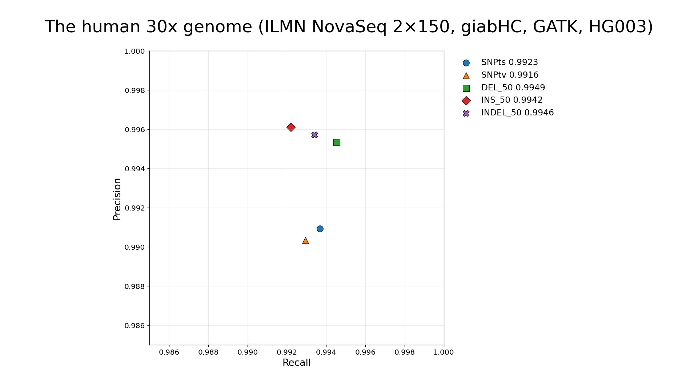
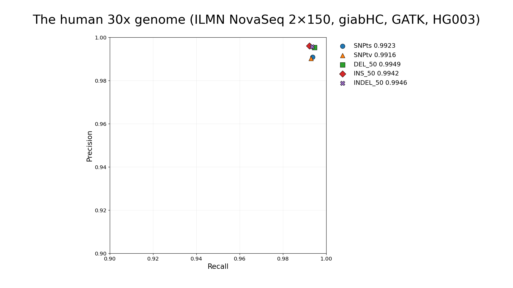
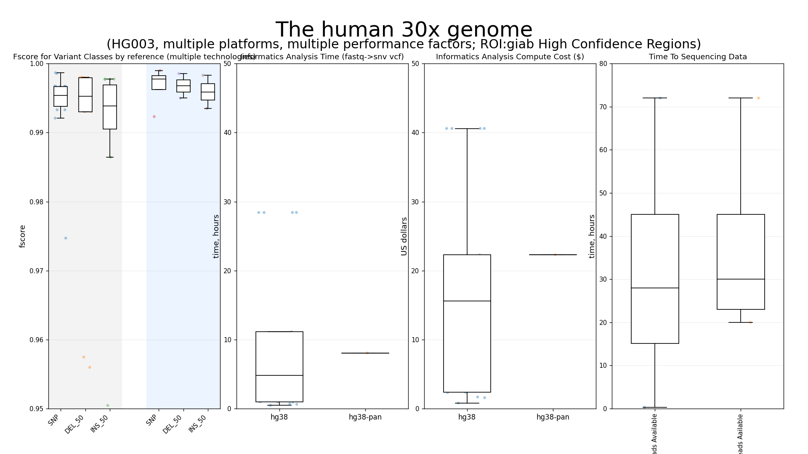
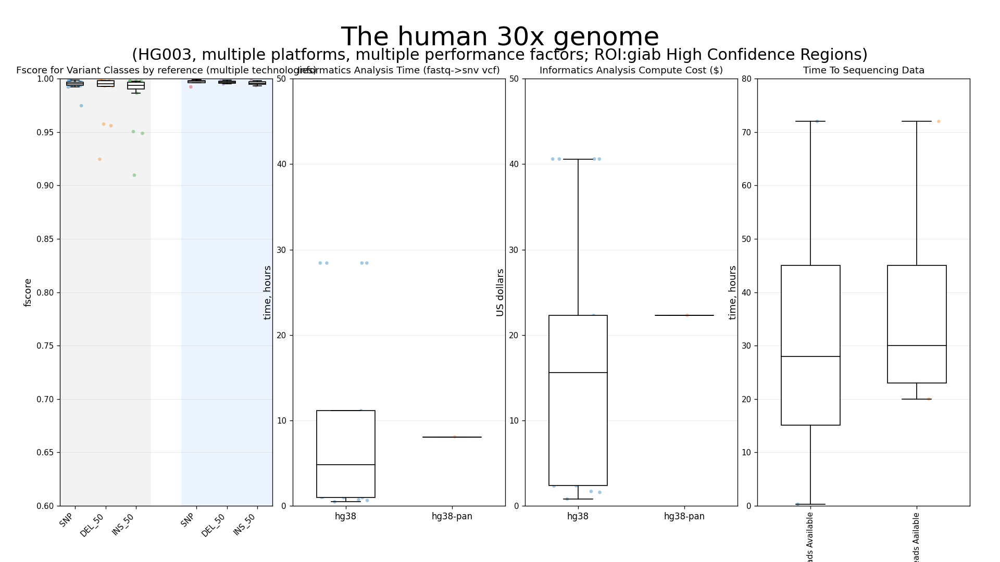
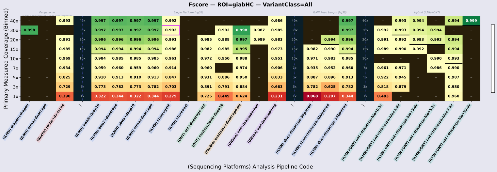

# From 30× Genomes to Application‑Defined Genome Specifications

**Moving from coverage targets to outcome‑aligned performance metrics across accuracy, context, cost, and time.**

LSMC • https://lsmc.com  
QR → GitHub / data

Poster Number: 214
Dimensions: 46" x 46"

---

## COLUMN 1 — Why 30× Is No Longer Enough

### What “30×” Actually Encodes

- Mean mapped depth (not uniform coverage)
- Often evaluated only in bounded high‑confidence regions
- Aggregated summary metrics hide stratified heterogeneity
- Platform‑ and reference‑dependent behavior

> **Coverage is a scalar.  
> Genomes are multi‑dimensional systems.**

---

### Figure 1 — The Canonical 30× Genome

**Precision vs Recall (HG003, ILMN NovaSeq 2×150, GIAB HC, GATK)**  

Even within a single 30× genome, variant‑class performance differs.

| Variant Class | Fscore |
|---------------|--------|
| SNPts | 0.9923 |
| SNPtv | 0.9916 |
| DEL_50 | 0.9949 |
| INS_50 | 0.9942 |
| INDEL_50 | 0.9946 |

#### Alt

#### Alt

---

## COLUMN 2 — A 30× Genome Is Not One Thing

Holding depth constant does not hold performance constant.

### Figure 2A — Stratified Fscore Distributions

- hg38‑SNP  
- hg38‑DEL_50  
- hg38‑INS_50  
- hg38‑pan equivalents  
- hybrid equivalents  

Even at fixed depth, distributions widen across reference, pipeline, and hybridization strategy.

#### Alt

---

### What 30× Does Not Specify

- ROI completeness (e.g., ClinVar genes)
- Difficult‑region recovery
- Structural variant performance
- Reference bias impact
- Cost ceilings
- Turnaround guarantees

---

## COLUMN 3 — The Application‑Defined Genome

### Centerpiece — Multi‑Perspective Heatmap

Different configurations optimize different outcomes.

#### ROI‑focused performance 

#### Cost And Time

### Panel Concepts (Stacked Heatmaps)

**Genome‑wide performance view**
- SNP Fscore
- DEL_50 Fscore
- INS_50 Fscore

**ROI‑focused performance (e.g., ClinVar genes)**
- ROI callable fraction
- ROI SNP Fscore
- ROI indel Fscore
- Difficult‑region recall within ROI

**Cost & Time constraints**
- Secondary analysis cost
- Time to first usable sequence data
- Total analysis runtime

Applications dictate which dimensions matter.

---

## Application‑First Genomic Capability

Instead of specifying genomes by coverage alone, we define application‑specific performance targets across:

- Accuracy in defined regions  
- Performance in difficult contexts  
- Cost ceilings  
- Turnaround guarantees  

At LSMC, platform, reference, pipeline, depth, cost, and turnaround time are tunable variables aligned to defined application requirements.

Bring the application specification.  
We’ll help identify the configuration that meets it.

---

## Methods & Transparency

- Sample: HG003  
- Benchmark: GIAB high‑confidence regions  
- Stratifications applied  
- Reference builds compared (hg38, pangenome)  
- Alignment/caller stacks evaluated  
- Depth mixtures tested  
- Cost tracking via cloud runtime logging  
- Runtime tracking via workflow instrumentation  

**Limitations**
- Single benchmark sample  
- Lack of gold standard samples naive to model training
- Benchmark regions bounded  
- Some analyses still running (data snapshot as of 2026-02-21T1130Z)

---

## References

- Krusche et al., Nat Biotechnol 2019  
- Dwarshuis et al., Nat Methods 2024  
- Wagner et al., Nat Biotechnol 2022  
- Kosugi et al., Genome Biol 2019  
- Li et al., Genome Med 2021  
- Liao et al., Nature 2023  
- Benjamini & Speed, NAR 2012  
- Jennings et al., J Mol Diagn 2017  

--- 
https://www.nature.com/articles/s41467-024-53260-y?utm_source=chatgpt.com

