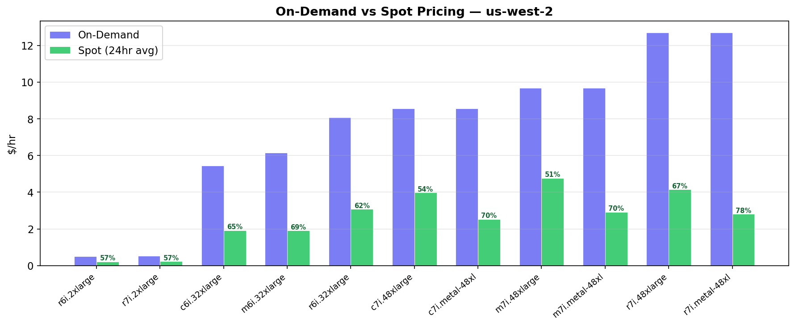
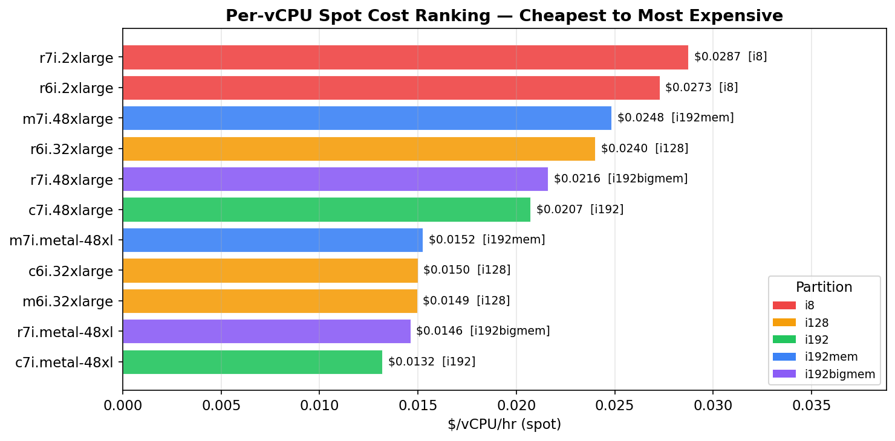
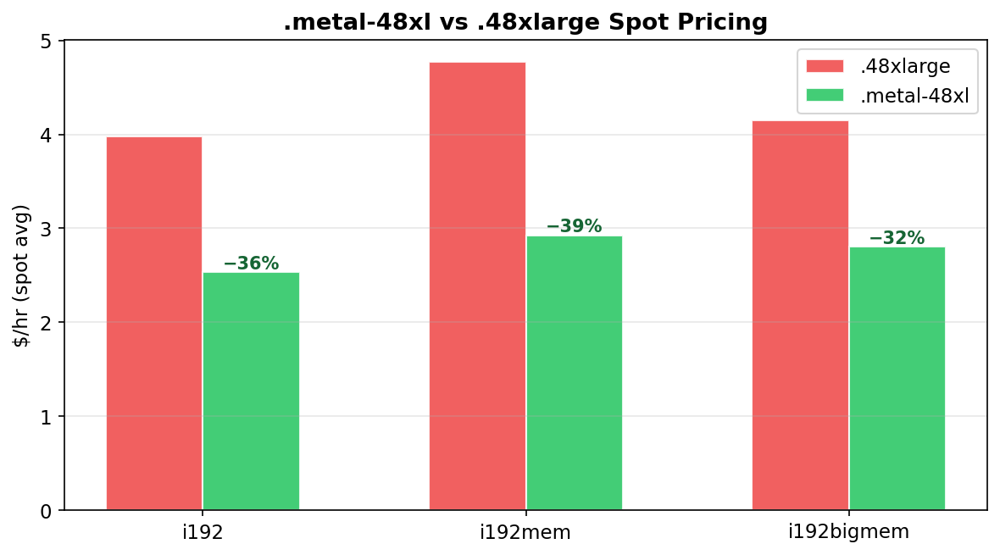
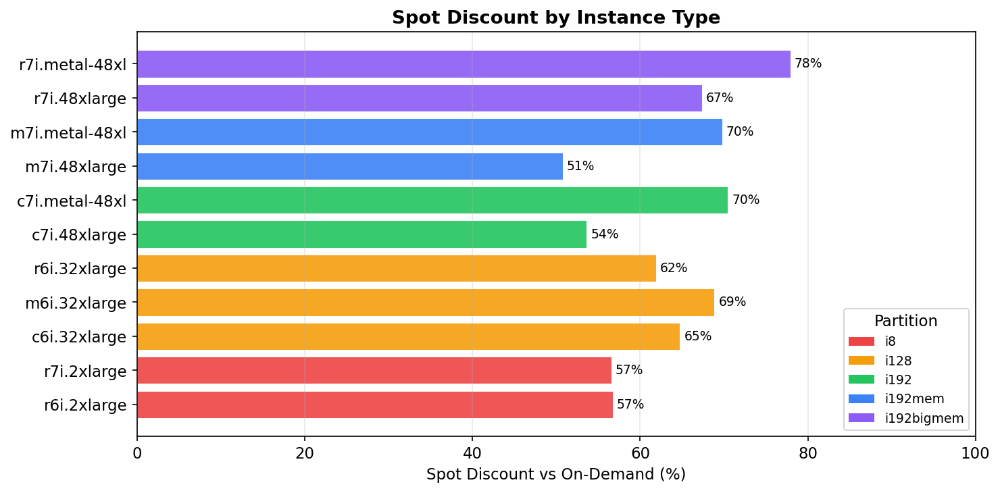

# AWS Compute Cost Analysis — Daylily ParallelCluster

> **Region:** us-west-2 · **Date:** 2026-02-18 · **Source:** AWS Pricing API (on-demand) + EC2 spot-price-history (24hr avg)

---

## Partition → Instance Type Mapping

| Partition | Instance Type(s) | vCPU | RAM (GiB) | Slurm Memory |
|---|---|---|---|---|
| **i8** | r6i.2xlarge, r7i.2xlarge | 8 | 64 | 62,259 MiB |
| **i128** | c6i.32xlarge | 128 | 256 | 249,036 MiB |
| **i128** | m6i.32xlarge | 128 | 512 | 498,073 MiB |
| **i128** | r6i.32xlarge | 128 | 1,024 | 996,147 MiB |
| **i192** | c7i.48xlarge / c7i.metal-48xl | 192 | 384 | 373,555 MiB |
| **i192mem** | m7i.48xlarge / m7i.metal-48xl | 192 | 768 | 747,110 MiB |
| **i192bigmem** | r7i.48xlarge / r7i.metal-48xl | 192 | 1,536 | 1,494,220 MiB |

---

## On-Demand vs Spot Pricing

### On-Demand Pricing (us-west-2)

| Instance Type | Partition | vCPU | $/hr | $/vCPU/hr | $/GiB/hr |
|---|---|---:|---:|---:|---:|
| r6i.2xlarge | i8 | 8 | $0.5040 | $0.0630 | $0.0079 |
| r7i.2xlarge | i8 | 8 | $0.5292 | $0.0662 | $0.0083 |
| c6i.32xlarge | i128 | 128 | $5.4400 | $0.0425 | $0.0213 |
| m6i.32xlarge | i128 | 128 | $6.1440 | $0.0480 | $0.0120 |
| r6i.32xlarge | i128 | 128 | $8.0640 | $0.0630 | $0.0079 |
| c7i.48xlarge | i192 | 192 | $8.5680 | $0.0446 | $0.0223 |
| c7i.metal-48xl | i192 | 192 | $8.5680 | $0.0446 | $0.0223 |
| m7i.48xlarge | i192mem | 192 | $9.6768 | $0.0504 | $0.0126 |
| m7i.metal-48xl | i192mem | 192 | $9.6768 | $0.0504 | $0.0126 |
| r7i.48xlarge | i192bigmem | 192 | $12.7008 | $0.0662 | $0.0083 |
| r7i.metal-48xl | i192bigmem | 192 | $12.7008 | $0.0662 | $0.0083 |

### Spot Pricing (last 24hr avg, us-west-2)

| Instance Type | Partition | $/hr avg | $/vCPU/hr | Spot Discount | $/hr range |
|---|---|---:|---:|---:|---|
| r6i.2xlarge | i8 | $0.2182 | $0.0273 | 57% off | $0.18 – $0.24 |
| r7i.2xlarge | i8 | $0.2299 | $0.0287 | 57% off | $0.22 – $0.24 |
| c6i.32xlarge | i128 | $1.9176 | $0.0150 | 65% off | $1.80 – $2.07 |
| m6i.32xlarge | i128 | $1.9134 | $0.0149 | 69% off | $1.21 – $2.28 |
| r6i.32xlarge | i128 | $3.0735 | $0.0240 | 62% off | $2.65 – $3.43 |
| c7i.48xlarge | i192 | $3.9752 | $0.0207 | 54% off | $3.24 – $4.78 |
| **c7i.metal-48xl** | **i192** | **$2.5336** | **$0.0132** | **70% off** | $1.77 – $3.00 |
| m7i.48xlarge | i192mem | $4.7666 | $0.0248 | 51% off | $2.95 – $5.45 |
| m7i.metal-48xl | i192mem | $2.9257 | $0.0152 | 70% off | $2.61 – $3.12 |
| r7i.48xlarge | i192bigmem | $4.1475 | $0.0216 | 67% off | $4.08 – $4.27 |
| r7i.metal-48xl | i192bigmem | $2.8058 | $0.0146 | 78% off | $1.99 – $3.45 |

---

## Per-vCPU Cost Ranking (Spot)

| Rank | Instance | $/vCPU/hr | Partition |
|---:|---|---:|---|
| 1 | **c7i.metal-48xl** | **$0.0132** | i192 |
| 2 | r7i.metal-48xl | $0.0146 | i192bigmem |
| 3 | m6i.32xlarge | $0.0149 | i128 |
| 4 | c6i.32xlarge | $0.0150 | i128 |
| 5 | m7i.metal-48xl | $0.0152 | i192mem |
| 6 | c7i.48xlarge | $0.0207 | i192 |
| 7 | r7i.48xlarge | $0.0216 | i192bigmem |
| 8 | r6i.32xlarge | $0.0240 | i128 |
| 9 | m7i.48xlarge | $0.0248 | i192mem |
| 10 | r6i.2xlarge | $0.0273 | i8 |
| 11 | r7i.2xlarge | $0.0287 | i8 |

---

## .metal-48xl vs .48xlarge Spot Pricing

The `.metal-48xl` variants are **30–45% cheaper** on spot despite being identical hardware to the `.48xlarge` counterparts. The likely explanation: fewer spot bidders target the metal SKU.

| Partition | .48xlarge $/hr | .metal-48xl $/hr | Spot Savings |
|---|---:|---:|---:|
| i192 | $3.9752 | $2.5336 | **36%** |
| i192mem | $4.7666 | $2.9257 | **39%** |
| i192bigmem | $4.1475 | $2.8058 | **32%** |

---

## Spot Discount vs On-Demand

---

## Key Findings & Recommendations

1. **i8 is the most expensive per vCPU** — both on-demand ($0.063–$0.066) and spot ($0.027–$0.029). The "small node = cheaper" intuition is **wrong** for multi-tenant workloads.

2. **`.metal-48xl` spot variants are dramatically cheaper than `.48xlarge`** — 30–45% less on spot despite identical hardware. Fewer bidders on metal SKUs.

3. **For concordance (multi-tenant packing):**
   - Keep concordance on `i192,i192mem,i128` partitions (where it already runs)
   - Reduce threads from 48 → 8 to pack **24 jobs per 192-vCPU node**
   - Cost per concordance job drops from **$0.596** → **$0.053** (11× cheaper)
     - Before: `48/192 × $4.77/hr × ~0.5hr = $0.596` (m7i.48xlarge)
     - After: `8/192 × $2.53/hr × ~0.5hr = $0.053` (c7i.metal-48xl)

4. **Don't move concordance to i8** — you'd pay more per vCPU AND lose multi-tenancy benefits.