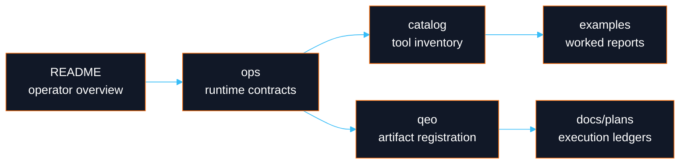

# DayOA Documentation Index

**Start with the ecosystem boundary.** `daylily-ephemeral-cluster` is the critical cluster, FSx, SSM, reference, and staging companion for this repo. Ursa and Bloom are also key Daylily services. DayOA is the execution plane only: it consumes prepared `samples.tsv` and `units.tsv`, runs Snakemake 7 workflows, and emits evidence for Dewey/QEO/R2.

## Current Documentation

| Area | Document |
|---|---|
| Operator entry point | [`../README.md`](../README.md) |
| Tool and pipeline inventory | [`catalog_of_tools.md`](catalog_of_tools.md) |
| MultiQC operations | [`ops/multiqc_qc_targets.md`](ops/multiqc_qc_targets.md) |
| CLI notes | [`ops/dycli.md`](ops/dycli.md) |
| QEO reconnaissance | [`qeo/QEO_DAYOA_RECON.md`](qeo/QEO_DAYOA_RECON.md) |
| QEO integration | [`qeo/QEO_DAYOA_INTEGRATION.md`](qeo/QEO_DAYOA_INTEGRATION.md) |
| Dewey registration configuration | [`qeo/QEO_DEWEY_CONFIGURATION_GUIDE.md`](qeo/QEO_DEWEY_CONFIGURATION_GUIDE.md) |
| Snakemake registration | [`qeo/QEO_SNAKEMAKE7_REGISTRATION.md`](qeo/QEO_SNAKEMAKE7_REGISTRATION.md) |
| MultiQC artifact model | [`qeo/QEO_MULTIQC_ARTIFACT_MODEL.md`](qeo/QEO_MULTIQC_ARTIFACT_MODEL.md) |
| Golden corpus test plan | [`qeo/QEO_GOLDEN_CORPUS_TEST_PLAN.md`](qeo/QEO_GOLDEN_CORPUS_TEST_PLAN.md) |
| Example MultiQC reports | [`examples/multiqc/README.md`](examples/multiqc/README.md) |
| Ultima run QC contracts | [`specs/ultima_run_qc_requirements.md`](specs/ultima_run_qc_requirements.md), [`workflows/ultima_run_qc.md`](workflows/ultima_run_qc.md) |

Legacy material moved to [`../quarantine/legacy-docs/`](../quarantine/legacy-docs/). The active `docs/plans/` tree remains in place because those files are durable execution ledgers.

## Documentation Flow

## Rules For Future Docs

- Keep top-of-page boundaries explicit: DayOA executes; Dewey registers; QEO observes; R2 interprets and releases.
- Use worked examples with exact commands and exact expected artifacts.
- Mark cluster-dependent examples as requiring a working `daylily-ec`/SSM headnode unless they have been verified live.
- Prefer Mermaid diagrams where they clarify ownership, DAG shape, artifact identity, or replay semantics.
- Do not document fallback behavior. Missing config, missing files, or malformed identity should fail hard.
