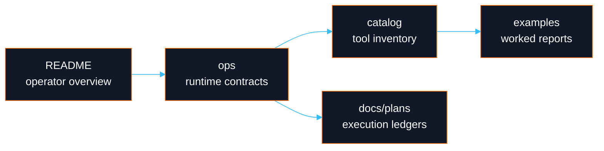

# DayOA Documentation Index

**Start with the ecosystem boundary.** `daylily-ephemeral-cluster` is the critical cluster, FSx, SSM, reference, staging, export, and downstream registration companion for this repo. Ursa and Bloom are also key Daylily services. DayOA is the execution plane only: it consumes prepared `samples.tsv` and `units.tsv`, runs Snakemake 7 workflows, and emits local evidence.

## Current Documentation

| Area | Document |
|---|---|
| Operator entry point | [`../README.md`](../README.md) |
| Tool and pipeline inventory | [`catalog_of_tools.md`](catalog_of_tools.md) |
| MultiQC operations | [`ops/multiqc_qc_targets.md`](ops/multiqc_qc_targets.md) |
| Results directory structure | [`ops/results_directory_structure.md`](ops/results_directory_structure.md) |
| CLI notes | [`ops/dycli.md`](ops/dycli.md) |
| Example MultiQC reports | [`examples/multiqc/README.md`](examples/multiqc/README.md) |
| BCL Convert run-context workflow | [`workflows/bclconvert.md`](workflows/bclconvert.md) |
| Ultima run QC contracts | [`specs/ultima_run_qc_requirements.md`](specs/ultima_run_qc_requirements.md), [`workflows/ultima_run_qc.md`](workflows/ultima_run_qc.md) |

## Current Runtime Notes

- BCL Convert uses the mounted run directory directly. It does not copy an Illumina run directory into `results/` or `/dev/shm` before demultiplexing.
- BCL Convert launches one lane job per `Data/Intensities/BaseCalls/L###` directory, then merges lane FASTQs and reports locally.
- BCL Convert terminal targets run demux FastQC after FASTQ merge, generate collision-safe FastQC identifiers from run/lane/sample/RG/read fields, and include FastQC plus BCL Convert custom data in the focused MultiQC report.
- ONT and Ultima mounted run-QC targets include demux FASTQ QC. ONT uses SeqKit, nanoq, NanoStat, NanoPlot, and focused MultiQC; Ultima uses FastQC, SeqKit, and focused MultiQC.
- Run QC outputs live under `results/runs/<RUNID>/run_qc/<platform>/` unless `config/runs.tsv` provides an explicit `OUTPUT_ROOT`; BCL Convert outputs live under the sibling `results/runs/<RUNID>/bclconvert/` tree.
- The default BCL Convert sample-sheet contract injects `BarcodeMismatchesIndex1,0` and `BarcodeMismatchesIndex2,0` through generated lane sample sheets. Other sample-sheet settings are wired but intentionally unset until explicitly configured.
- Hybrid Ultima+ONT `sentdhuomr` Stage1 now hard-fails on Sentieon driver errors, validates BAMs before Stage2, and handles empty target/refined-region shards explicitly in later stages.

Legacy material moved to [`../quarantine/legacy-docs/`](../quarantine/legacy-docs/). The active `docs/plans/` tree remains in place because those files are durable execution ledgers.

## Documentation Flow

## Rules For Future Docs

- Keep top-of-page boundaries explicit: DayOA executes and emits local evidence; external orchestration handles export, registration, import, interpretation, and release.
- Use worked examples with exact commands and exact expected artifacts.
- Mark cluster-dependent examples as requiring a working `daylily-ec`/SSM headnode unless they have been verified live.
- Prefer Mermaid diagrams where they clarify ownership, DAG shape, artifact identity, or replay semantics.
- Do not document fallback behavior. Missing config, missing files, or malformed identity should fail hard.
