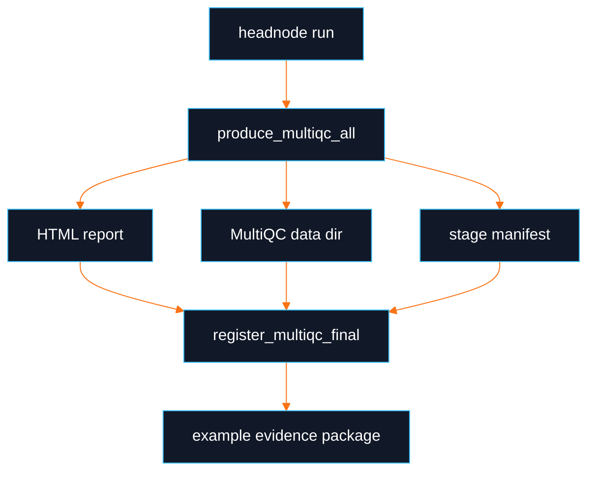

# Example MultiQC Reports

This directory documents how example MultiQC reports should be produced and verified. Live report artifacts are cluster-dependent and should only be claimed as verified after running on a working DayOA headnode through `daylily-ec`/SSM with an explicit non-default AWS profile.

## Local Synthetic Example

The registration tests build a small synthetic MultiQC data package:

```bash
eval "$(conda shell.zsh hook)" && conda activate DAY-EC
python -m pytest -q tests/test_qeo_registration.py
```

That test validates the registration contract, not biological content.

## Cluster Example Procedure

```bash
eval "$(conda shell.zsh hook)" && conda activate DAY-EC
AWS_PROFILE=<profile> daylily-ec headnode connect --profile <profile> --region <region> --cluster <cluster>
exec bash -l
id -un
command -v day-clone
command -v tmux
command -v squeue
```

Inside the tmux session:

```bash
cd /fsx/analysis_results/ubuntu
day-clone -t <git_ref> -d <workset_code>
cd /fsx/analysis_results/ubuntu/<workset_code>/daylily-omics-analysis
source dyoainit
dy-a slurm hg38
dy-r produce_multiqc_all -p -j 100 -k
dy-r produce_qeo_multiqc_registration -p -j 1
```

Expected report outputs:

- `results/day/<build>/reports/DAY_final_multiqc.html`
- `results/day/<build>/reports/DAY_final_multiqc_data/multiqc_data.json`
- `results/day/<build>/reports/DAY_final_multiqc_data/multiqc_general_stats.txt`
- `results/day/<build>/reports/DAY_final_multiqc_data/multiqc_sources.txt`
- `results/day/<build>/reports/DAY_final_multiqc_data/multiqc.log`
- `results/day/<build>/reports/DAY_final_multiqc.artifact_manifest.json`
- `results/day/<build>/reports/DAY_final_multiqc.dewey_receipt.json`
- `results/day/<build>/reports/DAY_final_multiqc.qeo_manifest.json`

## Visual Flow



