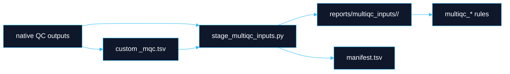

# MultiQC QC Targets

**Boundary:** MultiQC reports present evidence. They do not define canonical data, QC pass/fail state, disposition, or release. QEO registration happens after MultiQC generation and emits manifests/receipts for parser-ready ingest.

## Target Families

| Target | Scope |
|---|---|
| `produce_multiqc_input_data` | Sequence-data QC report. |
| `produce_multiqc_cram` | CRAM/alignment QC report. |
| `produce_multiqc_snv` | SNV/small-variant QC report. |
| `produce_multiqc_sv` | SV QC report. |
| `produce_multiqc_sample_qc` | Sample-level QC such as contamination and relatedness. |
| `produce_multiqc_variant_annotation` | Annotation QC when enabled. |
| `produce_multiqc_all` | Canonical all-routine-QC final report. |
| `produce_multiqc_seq_data` | Deprecated alias retained for now. |
| `produce_multiqc_alignment` | Deprecated alias retained for now. |
| `produce_multiqc_variants` | Deprecated alias retained for now. |
| `produce_multiqc_final` | Deprecated alias retained for now. |
| `produce_multiqc_final_wgs` | Deprecated alias retained for now. |
| `produce_qeo_multiqc_registration` | Register final MultiQC artifacts after report generation. |
| `produce_qeo_analysis_artifact_set` | Register final analysis artifact set. |
| `produce_qeo_ingest_event` | Emit replay-safe QEO outbox event. |

## Runtime Gating

Routine MultiQC targets intentionally exclude expensive or noisy tools unless explicitly enabled.

```yaml
multiqc_qc:
  runtime_gate_minutes: 45
  enable_tools: []
```

Examples:

```bash
dy-r produce_multiqc_all -p -j 20
dy-r produce_multiqc_all -p -j 20 --config enable_tools=["fastv"]
dy-r produce_multiqc_all -p -j 20 --config multiqc_qc.enable_tools=["metagenomics"]
```

`enable_tools=["fastv"]` explicitly opts into long-running FASTV evidence. `site_mix genotype-free contamination`, Kraken2 unmapped metagenomics, Ganon2 unmapped metagenomics, and sourmash gather secondary fingerprinting are also controlled by explicit runtime gates and configuration. `multiqc_qc.enable_tools=["metagenomics"]` is the umbrella kitchen-sink opt-in for all three metagenomics evidence branches.

## Staging Contract

All current reports use staged inputs under `reports/multiqc_inputs/<stage>/`.



Duplicate `(module, Sample)` pairs fail during staging. Stage-scoped identifiers preserve analysis depth:

- `<sample>.<aligner>.<deduper>.<snv_caller>`
- `<sample>.<aligner>.<deduper>.<sv_caller>`

Peddy CSVs and VerifyBamID `.selfSM` files are rewritten into stable custom-content TSVs before MultiQC. MultiQC sections use `parent_id` / `parent_name` grouping to keep related evidence together.

## Routine And Optional QC

| Area | Routine status |
|---|---|
| FastQC, SeqFu, alignment metrics, mosdepth, goleft, normal coverage evenness | Routine when inputs exist. |
| VerifyBamID2, GATK contamination, site-mix | Explicitly configured sample-level QC. |
| Relatedness and Peddy | Enabled when configured and parser inputs exist. |
| GIAB SNV/SV concordance | Enabled when truthsets and valid caller pairs exist. |
| VEP | Long-running, enabled explicitly. |
| Kraken2 unmapped metagenomics | Long-running, run with `produce_unmapped_metagenomics_quick`, `produce_metagenomics`, or final MultiQC only when `multiqc_qc.enable_tools=["unmapped_metagenomics"]` or `["metagenomics"]` and `unmapped_metagenomics.kraken2_db` are explicit. |
| Ganon2 unmapped metagenomics | Long-running, run with `produce_unmapped_metagenomics_ganon2_quick`, `produce_metagenomics`, or final MultiQC only when `multiqc_qc.enable_tools=["unmapped_metagenomics_ganon2"]` or `["metagenomics"]` and `unmapped_metagenomics.ganon2_db_prefixes` are explicit. |
| sourmash gather unmapped fingerprint | Long-running secondary fingerprint, run with `produce_unmapped_metagenomics_sourmash_gather`, `produce_metagenomics`, or final MultiQC only when `multiqc_qc.enable_tools=["unmapped_metagenomics_sourmash"]` or `["metagenomics"]` and `unmapped_metagenomics.sourmash_databases` plus sketch parameters are explicit. |
| Ultima run QC | Excluded from routine final MultiQC unless a parser-backed run-QC target explicitly enables Ultima run QC. |

QC gap: generated evidence can be absent because the tool was not configured, not because the sample passed or failed. Interpretive decisions belong to R2.

## Metagenomics Reference Configuration

DayOA does not infer metagenomics databases. Operators must provide explicit paths:

```yaml
unmapped_metagenomics:
  kraken2_db: /fsx/references/runtime_assets/tool_specific_resources/kraken2/<kraken_db_dir>
  ganon2_db_prefixes:
    - /fsx/references/runtime_assets/tool_specific_resources/ganon2/dayoa_qc_refseq_representative_core
    - /fsx/references/runtime_assets/tool_specific_resources/ganon2/dayoa_qc_vectors_adapters_phiX
  sourmash_databases:
    - /fsx/references/runtime_assets/tool_specific_resources/sourmash/dayoa_qc_refseq_representative_core.zip
    - /fsx/references/runtime_assets/tool_specific_resources/sourmash/dayoa_qc_vectors_adapters_phiX.zip
  sourmash_ksize: 31
  sourmash_scaled: 1000
  sourmash_moltype: DNA
  sourmash_threshold_bp: 3000
  threads: 32
  mem_mb: 128000
  partition: compute
  read_limit: all
```

The recommended first metagenomics QC reference is representative and reproducible, not maximal. This applies to Kraken2 database builds, Ganon2 database-prefix builds, and sourmash signature collections. Avoid full NT, all GenBank assemblies, all strains, and all eukaryotic assemblies as the first version. That shape is too large, expensive to update, redundant, and noisy for longitudinal QC trends.

Selection policy:

1. Prefer the RefSeq reference genome when available.
2. Else prefer the RefSeq representative genome.
3. Else prefer a GenBank representative assembly.
4. Keep one assembly per species by default.
5. For bacteria and archaea, optionally use GTDB representatives instead of NCBI species representatives.
6. Include all RefSeq viral genomes because viral genomes are small and underrepresented by species-level logic.
7. Include organellar genomes such as chloroplasts, mitochondria, and useful plasmids.
8. Include UniVec, PhiX, common adapters, and vector sequences as explicit process-artifact bins.
9. Include the exact human reference used upstream as a host-residue bin.
10. Freeze the manifest with assembly accession, taxid, source, assembly level, MD5/SHA256, and build date.

Prefer breadth over strain density:

| Domain | First-pass recommendation |
|---|---|
| Bacteria and archaea | RefSeq representative/reference assemblies; optional GTDB representative layer for microbial breadth. |
| Viruses | Broad complete viral references, because viral genomes are small and operationally important. |
| Fungi and protists | Representative RefSeq/GenBank genomes where available; avoid redundant draft floods. |
| Plants and animals | Representative environmental, agricultural, laboratory, and broad phylogenetic coverage. |
| Host/control | Production host reference, such as GRCh38 and optionally T2T, as an explicit host/control bin. |
| Process artifacts | UniVec, PhiX, common plasmids, vectors, and adapter references. |

RefSeq is curated and less redundant than GenBank. GenBank is broader but noisier. GTDB draws from RefSeq and GenBank, including draft genomes and MAGs/SAGs, and can improve bacterial/archaeal representation when used as an explicit optional layer.

## Run-QC And Benchmark Targets

The docs and catalog cover these report surfaces:

- `produce_illumina_run_qc`
- `produce_read_fate_river`
- `produce_ont_run_qc`
- `produce_ultima_run_qc`
- `produce_unmapped_metagenomics_quick`
- `produce_unmapped_metagenomics_ganon2_quick`
- `produce_unmapped_metagenomics_sourmash_gather`
- `produce_metagenomics`
- `giab_sv_concordance_mqc.tsv`

These surfaces produce evidence and custom content; they do not authorize clinical release.

## QEO Registration Boundary

Registration targets are downstream of MultiQC:

```bash
dy-r produce_multiqc_all -p -j 20
dy-r produce_qeo_multiqc_registration -p -j 1
dy-r produce_qeo_analysis_artifact_set -p -j 1
```

`register_multiqc_final` requires `DAY_final_multiqc.html`, `DAY_final_multiqc_data/`, staging manifests, parser-relevant files, and key `_mqc.tsv` files. It registers both the MultiQC directory and individual parser-relevant artifacts.
