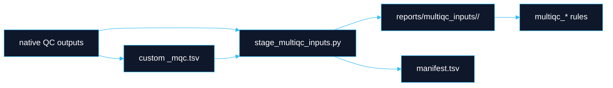

# MultiQC QC Targets

**Boundary:** MultiQC reports present evidence. They do not define canonical data, QC pass/fail state, disposition, release, or downstream registration. DayOA emits local evidence manifests after MultiQC generation.

## Target Families

| Target | Scope |
|---|---|
| `produce_multiqc_input_data` | Sequence-data QC report. |
| `produce_multiqc_cram` | CRAM/alignment QC report. |
| `produce_multiqc_snv` | SNV/small-variant QC report. |
| `produce_multiqc_sv` | SV QC report. |
| `produce_multiqc_sample_qc` | Sample-level QC such as contamination and relatedness. |
| `produce_multiqc_variant_annotation` | Annotation QC when enabled. |
| `produce_multiqc_all` | Canonical all-routine-QC final report. |
| `produce_multiqc_generic` | Generic existing-output scan. Runs MultiQC over the current `results/day/<build>/` tree with configured custom sections and writes `DAY_generic_multiqc.html` plus `DAY_generic_multiqc_sources.tsv`; it does not require or launch upstream analytical tools. |
| `produce_multiqc_altair` | Focused Altair validation report over concordance, relatedness, contamination, alignment, coverage, and variant-QC evidence. |
| `produce_multiqc_ultima_reanalysis` | Focused Ultima reanalysis report over concordance if available, alignment, coverage, relatedness, contamination, Peddy, SV, variant-QC, and ExpansionHunter evidence when enabled. |
| `produce_multiqc_seq_data` | Deprecated alias retained for now. |
| `produce_multiqc_alignment` | Deprecated alias retained for now. |
| `produce_multiqc_variants` | Deprecated alias retained for now. |
| `produce_multiqc_final` | Deprecated alias retained for now. |
| `produce_multiqc_final_wgs` | Deprecated alias retained for now. |
| `produce_dayoa_evidence_manifest` | Emit the final local DayOA evidence manifest after report generation. |

## Runtime Gating

Routine MultiQC targets intentionally exclude expensive or noisy tools unless explicitly enabled.

```yaml
multiqc_qc:
  runtime_gate_minutes: 45
  enable_tools: []
```

Examples:

```bash
dy-r produce_multiqc_all -p -j 20
dy-r produce_multiqc_generic -p -j 1
dy-r produce_multiqc_all -p -j 20 --config multiqc_qc.enable_tools=["metagenomics"]
dy-r produce_multiqc_all -p -j 20 --config multiqc_qc.enable_tools=["contam_identity"] snv_callers=["sentd"]
dy-r produce_multiqc_altair -p -j 20 --config multiqc_qc.enable_tools=["contam_identity"] snv_callers=["sentd"]
dy-r produce_multiqc_ultima_reanalysis -p -j 20 --config multiqc_qc.enable_tools=["contam_identity"] snv_callers=["sentpg"]
```

FASTV is retired from active Snakemake execution. `site_mix genotype-free contamination`, Kraken2 unmapped metagenomics, Ganon2 unmapped metagenomics, and sourmash gather secondary fingerprinting are controlled by explicit runtime gates and configuration. `multiqc_qc.enable_tools=["metagenomics"]` is the umbrella kitchen-sink opt-in for all three metagenomics evidence branches.

Global contamination/identity bundle evidence is long-running and explicit. `multiqc_qc.enable_tools=["contam_identity"]` stages the bundle into final MultiQC when it already exists or when `produce_global_contam_check` is requested.

## Staging Contract

All current reports use staged inputs under `reports/multiqc_inputs/<stage>/`.



Duplicate `(module, Sample)` pairs fail during staging. Stage-scoped identifiers preserve analysis depth:

- `<sample>.<aligner>.<deduper>.<snv_caller>`
- `<sample>.<aligner>.<deduper>.<sv_caller>`

Peddy CSVs and Somalier native files are rewritten before MultiQC. Haplocheck and read_haps native evidence is staged when the global contamination/identity bundle is enabled. MultiQC sections use `parent_id` / `parent_name` grouping to keep related evidence together.

## Routine And Optional QC

| Area | Routine status |
|---|---|
| FastQC, SeqFu, alignment metrics, mosdepth, goleft, normal coverage evenness | Routine when inputs exist. |
| GATK contamination and site-mix | Explicitly configured sample-level QC. |
| Global contamination/identity bundle | Long-running evidence-only target `produce_global_contam_check`: GATK contamination, site-mix, Haplocheck, read_haps, Peddy, and Somalier; emits `contam_identity_mqc.tsv`, `haplocheck_mtdna_mqc.tsv`, and `read_haps_mqc.tsv`. |
| Relatedness and Peddy | Enabled when configured and parser inputs exist. |
| GIAB SNV/SV concordance | Enabled when truthsets and valid caller pairs exist. |
| VEP | Long-running, enabled explicitly. |
| Kraken2 unmapped metagenomics | Long-running, run with `produce_unmapped_metagenomics_quick`, `produce_metagenomics`, or final MultiQC only when `multiqc_qc.enable_tools=["unmapped_metagenomics"]` or `["metagenomics"]` and `unmapped_metagenomics.kraken2_db` are explicit. |
| Ganon2 unmapped metagenomics | Long-running, run with `produce_unmapped_metagenomics_ganon2_quick`, `produce_metagenomics`, or final MultiQC only when `multiqc_qc.enable_tools=["unmapped_metagenomics_ganon2"]` or `["metagenomics"]` and `unmapped_metagenomics.ganon2_db_prefixes` are explicit. |
| sourmash gather unmapped fingerprint | Long-running secondary fingerprint, run with `produce_unmapped_metagenomics_sourmash_gather`, `produce_metagenomics`, or final MultiQC only when `multiqc_qc.enable_tools=["unmapped_metagenomics_sourmash"]` or `["metagenomics"]` and `unmapped_metagenomics.sourmash_databases` plus sketch parameters are explicit. |
| Ultima run QC | Excluded from routine final MultiQC unless a parser-backed run-QC target explicitly enables Ultima run QC. |
| ONT and Ultima demux FASTQ QC | Included in mounted `produce_ont_run_qc` and `produce_ultima_run_qc` targets when demux FASTQs are present under the explicit `RUN_DIR`; reported through focused run-QC MultiQC reports, not routine final WGS MultiQC. |

QC gap: generated evidence can be absent because the tool was not configured, not because the sample passed or failed. Interpretive decisions belong to R2.

## Altair Validation MultiQC

`produce_multiqc_altair` writes `reports/DAY_altair_multiqc.html` from the staged input tree `reports/multiqc_inputs/altair/`.

`produce_multiqc_ultima_reanalysis` writes `reports/DAY_ultima_reanalysis_multiqc.html` from the staged input tree `reports/multiqc_inputs/ultima_reanalysis/`. It reuses the focused validation input set and includes `expansionhunter_mqc.tsv` when ExpansionHunter is enabled for the active CRAM aligner set.

The focused Altair report consumes existing DayOA evidence only: sample/library context, alignment and coverage QC inventory, alignstats, samtools, mosdepth, goleft, normal coverage evenness, GATK/site-mix contamination summaries when enabled, global contamination/identity custom evidence when explicitly enabled, Somalier relatedness native files and `relatedness_mqc.tsv`, Peddy sample QC when enabled, GIAB SNV/SV concordance summaries when configured, and bcftools/RTG variant summary custom content. It does not create an alternate discovery path for arbitrary files.

FASTV, VerifyBamID2, NGSTroubleFinder, and CHARR are retired from active Snakemake execution. Historical FASTV and VerifyBamID2 rule/config files remain under `workflow/rules/archived_qc/` for provenance and old-run inspection; NGSTroubleFinder parser support remains for old evidence inspection. Active rules and final MultiQC no longer pull their outputs.

## Global Contamination/Identity Configuration

DayOA emits evidence only. It preserves native tool fields, including read_haps `PASS_FAIL` and `REASON`, without converting them into DayOA pass/fail state.

Required target:

```bash
dy-r produce_global_contam_check -p -j 20 --config snv_callers=["sentd"]
```

Minimum explicit config shape:

```yaml
contam_identity:
  primary_snv_caller: "sentd"

haplocheck:
  env_yaml: "../envs/haplocheck_v0.1.yaml"
  haplocheck_command: "haplocheck"
  cloudgene_command: "cloudgene"
  cloudgene_app: "haplocheck@1.2.2"
  input_modes: ["vcf"]
  threads: 8
  mem_mb: 16000
  partition: "i192,i192mem,i128"

read_haps:
  env_yaml: "../envs/read_haps_v0.1.yaml"
  read_haps_command: "/fsx/references/runtime_assets/tool_specific_resources/read_haps/read_haps"
  reliable_snp_file: /fsx/references/runtime_assets/tool_specific_resources/read_haps/high_quality_markers_deCODE_2015.txt.gz
  extra_args: ""
  threads: 8
  mem_mb: 32000
  partition: "i192,i192mem,i128"
```

`contam_identity.primary_snv_caller` must be present in explicit `snv_callers`; auto-detected caller state is rejected for this bundle. The default Haplocheck mode consumes the configured primary SNV caller VCF. read_haps uses the configured runtime-asset binary plus the explicit reliable SNP file.

Tool references:

| Tool | Link |
|---|---|
| Haplocheck | https://github.com/genepi/haplocheck |
| Haplocheck docs | https://mitoverse.readthedocs.io/haplocheck/haplocheck/ |
| read_haps | https://github.com/DecodeGenetics/read_haps |
| read_haps paper | https://doi.org/10.1093/bioinformatics/btaa936 |

## LongTR Catalog Configuration

DayOA runs LongTR as evidence-only ONT tandem-repeat genotyping. It does not infer catalog locations. The local and Slurm profile templates point to frozen catalogs in the shared DayOA reference runtime-assets prefix:

```yaml
longtr:
  env_yaml: ../envs/longtr_v0.1.yaml
  command: LongTR
  aligners: [ont, sentmm2ont]
  deduper: na
  catalogs:
    all:
      name: trexplorer_catalog
      regions_bed: /fsx/references/runtime_assets/tool_specific_resources/longtr/trexplorer_catalog/TRExplorer.repeat_catalog_v2.hg38.1_to_1000bp_motifs.LongTR.bed.gz
    diseaser:
      name: disease_repeat_catalog
      regions_bed: /fsx/references/runtime_assets/tool_specific_resources/longtr/disease_repeat_catalog/dayoa_STRchive-disease-loci.hg38.longtr.bed.gz
```

The corresponding S3 source of truth is:

- `s3://lsmc-dayoa-references-usw2/runtime_assets/tool_specific_resources/longtr/trexplorer_catalog/`
- `s3://lsmc-dayoa-references-usw2/runtime_assets/tool_specific_resources/longtr/disease_repeat_catalog/`

Run targets:

```bash
dy-r longtr_all -p -j 100 -k
dy-r longtr_diseaser -p -j 100 -k
```

`longtr_all` uses the Broad/TRExplorer genome-wide LongTR BED catalog. `longtr_diseaser` uses the DayOA disease-repeat catalog converted from the STRchive/ExpansionHunter hg38 JSON catalog. LongTR can consume BAM/CRAM, but the CRAM must use the same FASTA configured for the workflow genome build.

Tool references:

| Tool/resource | Link |
|---|---|
| LongTR | https://github.com/gymrek-lab/LongTR |
| TRExplorer catalog | https://github.com/broadinstitute/trexplorer-catalog |
| ExpansionHunter catalog format | https://github.com/Illumina/ExpansionHunter |
| STRchive | https://strchive.org |

## Metagenomics Reference Configuration

DayOA does not infer unavailable metagenomics databases. The local and Slurm profile templates provide confirmed defaults for Kraken2 PlusPFP-16, the current Ganon2 ABFV top-1 database, and the GTDB RS226 k=31 DNA sourmash species-representative collection published under the shared runtime-asset reference bucket.

```yaml
unmapped_metagenomics:
  kraken2_db: /fsx/references/runtime_assets/tool_specific_resources/metagenomics/kraken2/k2_pluspfp_16_GB_20260226
  ganon2_db_prefixes:
    - /fsx/references/runtime_assets/tool_specific_resources/ganon2/dayoa_qc_refseq_abfv_complete_top1_20260528
  sourmash_databases:
    - /fsx/references/runtime_assets/tool_specific_resources/sourmash/gtdb-rs226/gtdb-reps-rs226-k31.dna.zip
  sourmash_ksize: 31
  sourmash_scaled: 1000
  sourmash_moltype: DNA
  sourmash_threshold_bp: 3000
  threads: 32
  mem_mb: 128000
  partition: compute
  read_limit: all
```

The recommended first metagenomics QC reference is representative and reproducible, not maximal. This applies to Kraken2 database builds, Ganon2 database-prefix builds, and sourmash signature collections. Avoid full NT, all GenBank assemblies, all strains, and all eukaryotic assemblies as the first version. That shape is too large, expensive to update, redundant, and noisy for longitudinal QC trends.

Selection policy:

1. Prefer the RefSeq reference genome when available.
2. Else prefer the RefSeq representative genome.
3. Else prefer a GenBank representative assembly.
4. Keep one assembly per species by default.
5. For bacteria and archaea, optionally use GTDB representatives instead of NCBI species representatives.
6. Include all RefSeq viral genomes because viral genomes are small and underrepresented by species-level logic.
7. Include organellar genomes such as chloroplasts, mitochondria, and useful plasmids.
8. Include UniVec, PhiX, common adapters, and vector sequences as explicit process-artifact bins.
9. Include the exact human reference used upstream as a host-residue bin.
10. Freeze the manifest with assembly accession, taxid, source, assembly level, MD5/SHA256, and build date.

Prefer breadth over strain density:

| Domain | First-pass recommendation |
|---|---|
| Bacteria and archaea | RefSeq representative/reference assemblies; optional GTDB representative layer for microbial breadth. |
| Viruses | Broad complete viral references, because viral genomes are small and operationally important. |
| Fungi and protists | Representative RefSeq/GenBank genomes where available; avoid redundant draft floods. |
| Plants and animals | Representative environmental, agricultural, laboratory, and broad phylogenetic coverage. |
| Host/control | Production host reference, such as GRCh38 and optionally T2T, as an explicit host/control bin. |
| Process artifacts | UniVec, PhiX, common plasmids, vectors, and adapter references. |

RefSeq is curated and less redundant than GenBank. GenBank is broader but noisier. GTDB draws from RefSeq and GenBank, including draft genomes and MAGs/SAGs, and can improve bacterial/archaeal representation when used as an explicit optional layer.

## Run-QC And Benchmark Targets

The docs and catalog cover these report surfaces:

- `produce_illumina_run_qc`
- `produce_read_fate_river`
- `produce_ont_run_qc`
- `produce_ont_demux_fastq_qc`
- `produce_ultima_run_qc`
- `produce_ultima_demux_fastq_qc`
- `produce_unmapped_metagenomics_quick`
- `produce_unmapped_metagenomics_ganon2_quick`
- `produce_unmapped_metagenomics_sourmash_gather`
- `produce_metagenomics`
- `giab_sv_concordance_mqc.tsv`

These surfaces produce evidence and custom content; they do not authorize clinical release.

## Local Evidence Boundary

The local evidence manifest target is downstream of MultiQC:

```bash
dy-r produce_multiqc_all -p -j 20
dy-r produce_dayoa_evidence_manifest -p -j 1
```

`write_dayoa_evidence_manifest` requires `DAY_final_multiqc.html`, `DAY_final_multiqc_data/`, staging manifests, parser-relevant files, and key `_mqc.tsv` files. It records actual local files with relative paths, sizes, hashes, classifications, and parser relevance. It does not register artifacts or emit downstream ingest events.
