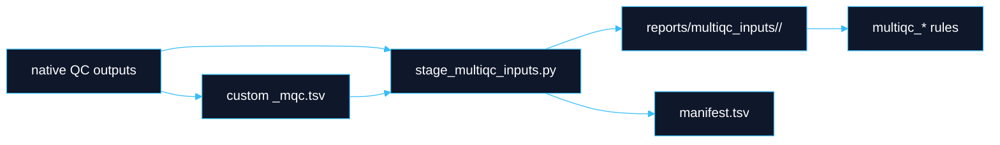

# MultiQC QC Targets

**Boundary:** MultiQC reports present evidence. They do not define canonical data, QC pass/fail state, disposition, or release. QEO registration happens after MultiQC generation and emits manifests/receipts for parser-ready ingest.

## Target Families

| Target | Scope |
|---|---|
| `produce_multiqc_input_data` | Sequence-data QC report. |
| `produce_multiqc_cram` | CRAM/alignment QC report. |
| `produce_multiqc_snv` | SNV/small-variant QC report. |
| `produce_multiqc_sv` | SV QC report. |
| `produce_multiqc_sample_qc` | Sample-level QC such as contamination and relatedness. |
| `produce_multiqc_variant_annotation` | Annotation QC when enabled. |
| `produce_multiqc_all` | Canonical all-routine-QC final report. |
| `produce_multiqc_seq_data` | Deprecated alias retained for now. |
| `produce_multiqc_alignment` | Deprecated alias retained for now. |
| `produce_multiqc_variants` | Deprecated alias retained for now. |
| `produce_multiqc_final` | Deprecated alias retained for now. |
| `produce_multiqc_final_wgs` | Deprecated alias retained for now. |
| `produce_qeo_multiqc_registration` | Register final MultiQC artifacts after report generation. |
| `produce_qeo_analysis_artifact_set` | Register final analysis artifact set. |
| `produce_qeo_ingest_event` | Emit replay-safe QEO outbox event. |

## Runtime Gating

Routine MultiQC targets intentionally exclude expensive or noisy tools unless explicitly enabled.

```yaml
multiqc_qc:
  runtime_gate_minutes: 45
  enable_tools: []
```

Examples:

```bash
dy-r produce_multiqc_all -p -j 20
dy-r produce_multiqc_all -p -j 20 --config enable_tools=["fastv"]
```

`enable_tools=["fastv"]` explicitly opts into long-running FASTV evidence. `site_mix genotype-free contamination` and unmapped metagenomics are also controlled by explicit runtime gates and configuration.

## Staging Contract

All current reports use staged inputs under `reports/multiqc_inputs/<stage>/`.



Duplicate `(module, Sample)` pairs fail during staging. Stage-scoped identifiers preserve analysis depth:

- `<sample>.<aligner>.<deduper>.<snv_caller>`
- `<sample>.<aligner>.<deduper>.<sv_caller>`

Peddy CSVs and VerifyBamID `.selfSM` files are rewritten into stable custom-content TSVs before MultiQC. MultiQC sections use `parent_id` / `parent_name` grouping to keep related evidence together.

## Routine And Optional QC

| Area | Routine status |
|---|---|
| FastQC, SeqFu, alignment metrics, mosdepth, goleft, normal coverage evenness | Routine when inputs exist. |
| VerifyBamID2, GATK contamination, site-mix | Explicitly configured sample-level QC. |
| Relatedness and Peddy | Enabled when configured and parser inputs exist. |
| GIAB SNV/SV concordance | Enabled when truthsets and valid caller pairs exist. |
| VEP | Long-running, enabled explicitly. |
| Ultima run QC | Excluded from routine final MultiQC unless a parser-backed run-QC target explicitly enables Ultima run QC. |

QC gap: generated evidence can be absent because the tool was not configured, not because the sample passed or failed. Interpretive decisions belong to R2.

## Run-QC And Benchmark Targets

The docs and catalog cover these report surfaces:

- `produce_illumina_run_qc`
- `produce_read_fate_river`
- `produce_ont_run_qc`
- `produce_ultima_run_qc`
- `produce_unmapped_metagenomics_quick`
- `giab_sv_concordance_mqc.tsv`

These surfaces produce evidence and custom content; they do not authorize clinical release.

## QEO Registration Boundary

Registration targets are downstream of MultiQC:

```bash
dy-r produce_multiqc_all -p -j 20
dy-r produce_qeo_multiqc_registration -p -j 1
dy-r produce_qeo_analysis_artifact_set -p -j 1
```

`register_multiqc_final` requires `DAY_final_multiqc.html`, `DAY_final_multiqc_data/`, staging manifests, parser-relevant files, and key `_mqc.tsv` files. It registers both the MultiQC directory and individual parser-relevant artifacts.

