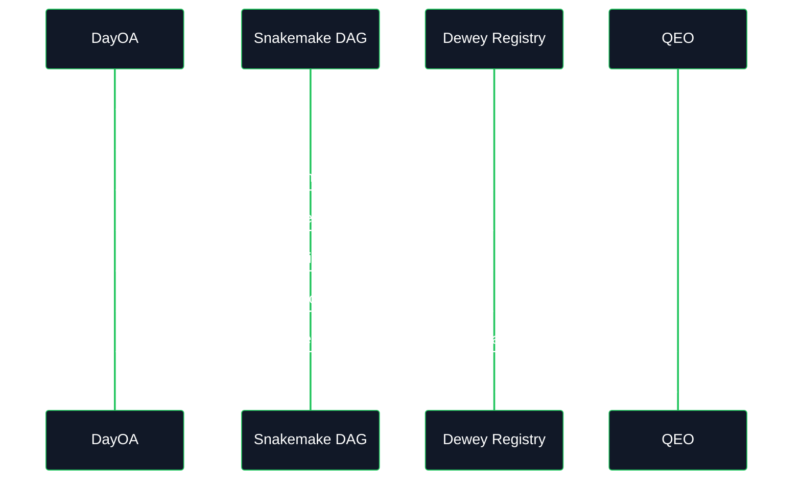

# QEO/KEO Artifact Registration Integration

**Top-level rule:** DayOA produces immutable evidence. Dewey registers canonical artifacts. QEO observes registered evidence. R2 interprets QC and release state.

DayOA now emits deterministic registration manifests as normal Snakemake outputs. It does not become a registry, parser authority, QC authority, or release authority.

## Integration Contract

| Plane | Owns | Does not own |
|---|---|---|
| DayOA | Workflow execution, native outputs, `_mqc.tsv`, MultiQC reports, deterministic manifests, outbox event files. | Canonical artifact identity, scientific interpretation, release decisions. |
| Dewey | Artifact EUIDs, artifact sets, receipts, registry identity, storage refs. | Pipeline execution or QC interpretation. |
| QEO/KEO | Parser-ready ingestion, observation normalization, evidence exploration. | Raw filesystem crawling or release decisions. |
| R2 | QC interpretation, disposition, release authority. | Artifact generation or registry identity. |

## Registration Modes

`qeo_registration.mode` must be explicit.

| Mode | Behavior |
|---|---|
| `local_only` | Writes deterministic manifests and receipts marked `local_only`. It does not fabricate Dewey EUIDs. |
| `dewey` | Requires `dewey_url`, token or token env var, and `storage_root_uri` using `s3://...`. Missing values fail hard. |

Example local-only config fragment:

```yaml
qeo_registration:
  mode: local_only
  analysis_euid: Z-ANL-EXAMPLE
  run_euid: Z-RUN-EXAMPLE
  workset_euid: Z-WRK-EXAMPLE
  snakemake_version: "7.32.4"
```

Example Dewey config fragment:

```yaml
qeo_registration:
  mode: dewey
  dewey_url: https://dewey.example.internal
  dewey_token_env: DEWEY_BEARER_TOKEN
  storage_root_uri: s3://lsmc-dayoa-omics-analysis-us-west-2/runs/Z-ANL-EXAMPLE/daylily-omics-analysis
  analysis_euid: Z-ANL-EXAMPLE
  run_euid: Z-RUN-EXAMPLE
  workset_euid: Z-WRK-EXAMPLE
  snakemake_version: "7.32.4"
```

## Outputs

`register_multiqc_final` produces:

- `results/day/<build>/reports/DAY_final_multiqc.artifact_manifest.json`
- `results/day/<build>/reports/DAY_final_multiqc.dewey_receipt.json`
- `results/day/<build>/reports/DAY_final_multiqc.qeo_manifest.json`

`register_analysis_artifact_set` produces:

- `results/day/<build>/reports/analysis_artifact_set.manifest.json`
- `results/day/<build>/reports/analysis_artifact_set.dewey_receipt.json`
- `results/day/<build>/reports/analysis_artifact_set.qeo_ingest_manifest.json`

`publish_qeo_ingest_event` produces:

- `results/day/<build>/reports/qeo/outbox/lsmc.daylily.artifact.produced.v1.json`

## Replay And Idempotency



Replay is safe because file identity is SHA256-based, manifest checksums are canonical JSON, and Dewey idempotency keys are derived from producer, artifact type, storage URI, and manifest checksum.

## Event Envelope

The current outbox event is `lsmc.daylily.artifact.produced.v1`:

```json
{
  "event_id": "evt_<deterministic_sha256>",
  "event_type": "lsmc.daylily.artifact.produced.v1",
  "occurred_at": "2026-05-26T18:30:00Z",
  "producer": {"system": "daylily-omics-analysis", "role": "execution_plane"},
  "schema_version": "1",
  "payload": {
    "analysis_euid": "Z-ANL-EXAMPLE",
    "run_euid": "Z-RUN-EXAMPLE",
    "workset_euid": "Z-WRK-EXAMPLE",
    "manifest_kind": "dayoa.analysis_artifact_set",
    "manifest_checksum": "<sha256>",
    "artifact_set_refs": ["<dewey-or-local-artifact-set-ref>"],
    "artifact_count": 10
  },
  "correlation_id": "<manifest_checksum>",
  "causation_id": null
}
```

Events must not contain PHI. They carry EUIDs, checksums, counts, and artifact-set references.

