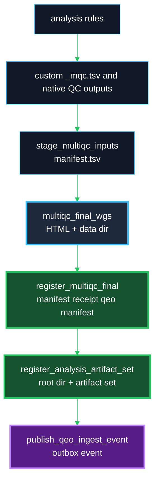
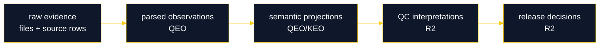

# QEO DayOA Reconnaissance

**Boundary:** DayOA is the execution plane. It produces evidence and deterministic manifests. Dewey owns canonical artifact registration. QEO/KEO ingests Dewey receipts and manifests. R2 remains the sole QC, disposition, and release authority.

## Repo Surfaces

| Surface | Paths | Current behavior | QEO relevance | Risk | Recommended modification |
|---|---|---|---|---|---|
| Final MultiQC generation | `workflow/rules/multiqc_final_wgs.smk`, rule `multiqc_final_wgs` | Generates `results/day/<build>/reports/DAY_final_multiqc.html`, dark-mode backup, header YAML, and side-effect `DAY_final_multiqc_data/`. | Final aggregation boundary before registration. | Registration inside this rule would mix report generation with registry authority. | Keep as artifact generation only. Add downstream registration rules. |
| MultiQC staged inputs | `workflow/scripts/stage_multiqc_inputs.py`, rule `stage_multiqc_inputs` | Copies parser inputs into `reports/multiqc_inputs/<stage>/` and writes deterministic `manifest.tsv`. Duplicate `(module, Sample)` groups fail. | Strong source-row and staged-path provenance for QEO parser hints. | Parser crawling raw output trees would lose staging intent. | Register and ingest the stage manifest as parser-relevant evidence. |
| Custom `_mqc.tsv` outputs | `workflow/rules/multiqc_final_wgs.smk`, `workflow/scripts/*_mqc*.py`, `bin/util/benchmarks/*` | Generates DayOA-specific tables such as `alignstats_combo_mqc.tsv`, `bcftools_variant_stats_mqc.tsv`, `rtg_vcfstats_mqc.tsv`, `tiddit_sv_mqc.tsv`, `giab_sv_concordance_mqc.tsv`, `rules_benchmark_data_mqc.tsv`. | These tables are the most parser-friendly evidence surface. | Treating MultiQC HTML as canonical would hide raw rows. | Classify `_mqc.tsv` as parser-relevant key artifacts. |
| Final report outputs | `results/day/<build>/reports/` | Stores final HTML, original HTML, `DAY_final_multiqc_data/`, report logs, and benchmark summary. | Registration should bind these outputs into a replay-safe artifact set. | Missing required MultiQC files can produce partial packages. | Fail if `multiqc_data.json`, `multiqc_general_stats.txt`, `multiqc_sources.txt`, or `multiqc.log` are missing. |
| Current artifact registration | New `daylily_omics_analysis/qeo_registration.py`, `workflow/rules/qeo_registration.smk` | Adds local-only and Dewey registration paths after MultiQC generation. | Establishes explicit DayOA-to-Dewey handoff. | Dewey mode without storage identity would create unusable records. | Require explicit mode, Dewey URL/token, and `s3://` storage root for Dewey mode. |
| Run manifests | `config/samples.tsv`, `config/units.tsv`, staging manifests | `samples.tsv` and `units.tsv` describe workset inputs; staged MultiQC manifest describes report inputs. | Required for lineage and parser context. | Sample names are not identity. | Preserve raw sample values but use EUIDs and artifact refs for identity. |
| Pipeline metadata | `workflow/rules/global_common.smk`, `bin/day_run`, `daylily_omics_analysis/__init__.py` | Emits git tag/hash/branch and package version surfaces. | Required manifest provenance fields. | Missing values weaken replay. | Registration requires pipeline version, git SHA, Snakemake version, profile, and config hash. |
| Benchmarks/resources | `results/day/<build>/benchmarks/`, `results/day/<build>/reports/benchmarks_summary.tsv`, `other_reports/rules_benchmark_data_mqc.tsv` | Captures rule resources and summarized benchmark custom content. | QEO should observe resource evidence separately from biological observations. | Benchmark rows could be flattened into QC conclusions. | Preserve as benchmark artifacts and parsed observations only. |
| Sample normalization | `workflow/rules/common.smk`, `day_stage_sample_id`, `config/external_tools/multiqc_config.yaml`, `validate_multiqc_sample_ids.py` | Stage-scoped sample identifiers carry aligner/deduper/caller where needed. MultiQC sample cleanup is configured centrally. | Prevents collisions across parser families. | Collapsing sample names into identity breaks lineage. | Warn on collisions, preserve raw and stage-scoped names, do not infer identity. |
| Snakemake conventions | `workflow/Snakefile`, `workflow/rules/*.smk` | Snakemake 7 rules, localrules, profile-driven execution, no polling daemon. | DAG edge is the correct registration boundary. | Watchers/callback daemons would be harder to replay. | Keep registration as normal rules and optional outbox event. |
| Existing QC output structures | `results/day/<build>/<sample>/`, `other_reports/`, `reports/multiqc_inputs/`, `logs/` | Mixed native tool outputs, custom TSVs, logs, and report data. | Artifact set must preserve layers. | HTML-only or table-only ingestion loses provenance. | Register root analysis dir, key files, MultiQC directory, logs, benchmarks, and failure artifacts. |

## Required DAG Shape

## Evidence Semantics

QEO observations are not scientific truth. The evidence chain stays layered:

## Current Implementation Added

- `daylily_omics_analysis/qeo_registration.py`: deterministic inventories, SHA256 hashes, required-file enforcement, local-only receipts, Dewey request construction, QEO manifests, and replay-safe events.
- `workflow/scripts/register_qeo_artifacts.py`: thin CLI wrapper for Snakemake and manual use.
- `workflow/rules/qeo_registration.smk`: `register_multiqc_final`, `register_analysis_artifact_set`, `publish_qeo_ingest_event`, and target aliases.
- `tests/test_qeo_registration.py`: deterministic local-only and event/idempotency tests.

