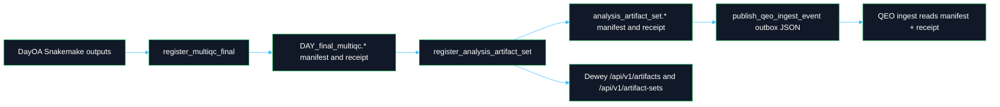
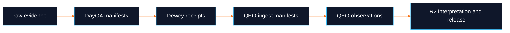

# Dewey Registration Configuration Guide

**Ecosystem boundary:** DayOA runs analysis and emits evidence. Dewey owns canonical artifact registration. QEO consumes Dewey receipts and parser-ready manifests. R2 owns QC interpretation, disposition, and release. `daylily-ephemeral-cluster` remains critical infrastructure for the headnode, FSx, SSM, references, and staging that make these rules runnable; Ursa and Bloom remain key Daylily services around launch and upstream sequencing state.

This guide is standalone and describes the exact `qeo_registration` configuration required for DayOA artifact registration.

## What Is Configured

The registration rules live in `workflow/rules/qeo_registration.smk` and call `daylily_omics_analysis/qeo_registration.py`.



Registration is not automatic for every workflow run. It happens only when the QEO registration targets are requested:

```bash
dy-r produce_qeo_multiqc_registration -p -j 1
dy-r produce_qeo_analysis_artifact_set -p -j 1
dy-r produce_qeo_ingest_event -p -j 1
```

## Where To Put The Config

Put the `qeo_registration` block in the active DayOA profile config for the analysis run, usually:

```text
config/day_profiles/<profile>/rule_config.yaml
```

For generated profiles, put the same block into the relevant template before profile materialization:

```text
config/day_profiles/local/templates/rule_config.yaml
config/day_profiles/slurm/templates/rule_config.yaml
```

Do not rely on default discovery. If `qeo_registration` is absent, the registration rules fail before writing outputs.

## Common Required Fields

Every mode requires these fields:

```yaml
qeo_registration:
  mode: local_only
  analysis_euid: Z-ANL-EXAMPLE
  run_euid: Z-RUN-EXAMPLE
  workset_euid: Z-WRK-EXAMPLE
  snakemake_version: "7.32.4"
```

| Field | Required | Meaning |
|---|---:|---|
| `mode` | yes | Must be `local_only` or `dewey`. |
| `analysis_euid` | yes | Stable analysis identity for this artifact set. |
| `run_euid` | yes | Run identity linked to the analysis. |
| `workset_euid` | no | Workset identity when available. |
| `snakemake_version` | yes | Snakemake version used for the run. |

DayOA also records pipeline name, pipeline version, git SHA, workflow profile, workflow config hash, container images, and references from the active workflow/config context.

## Local-Only Mode

Use local-only mode to validate deterministic manifests without registering anything in Dewey:

```yaml
qeo_registration:
  mode: local_only
  analysis_euid: Z-ANL-EXAMPLE
  run_euid: Z-RUN-EXAMPLE
  workset_euid: Z-WRK-EXAMPLE
  snakemake_version: "7.32.4"
```

Local-only mode:

- writes manifests and receipts,
- marks receipts as `local_only`,
- does not call Dewey,
- does not require a Dewey URL,
- does not require a token,
- does not fabricate Dewey EUIDs.

Run:

```bash
source dyoainit
dy-a local hg38
dy-r produce_multiqc_all -p -j 1
dy-r produce_qeo_multiqc_registration -p -j 1
dy-r produce_qeo_analysis_artifact_set -p -j 1
dy-r produce_qeo_ingest_event -p -j 1
```

## Dewey Mode

Dewey mode requires an explicit Dewey URL, token source, and S3 storage root:

```yaml
qeo_registration:
  mode: dewey
  dewey_url: https://dewey.day.lsmc.bio/
  dewey_token_env: DEWEY_BEARER_TOKEN
  storage_root_uri: s3://lsmc-dayoa-analysis-results-usw2/validation/Z-ANL-EXAMPLE/ubuntu/Z-ANL-EXAMPLE/daylily-omics-analysis
  analysis_euid: Z-ANL-EXAMPLE
  run_euid: Z-RUN-EXAMPLE
  workset_euid: Z-WRK-EXAMPLE
  snakemake_version: "7.32.4"
```

Export the token before launching the registration targets:

```bash
export DEWEY_BEARER_TOKEN=<token>
```

`dewey_token` can also be set directly in config, but the preferred pattern is `dewey_token_env` so secrets are not written into the repo or run ledger.

Run on a configured headnode:

```bash
source dyoainit
dy-a slurm hg38
dy-r produce_multiqc_all -p -j 20
dy-r produce_qeo_multiqc_registration -p -j 1
dy-r produce_qeo_analysis_artifact_set -p -j 1
dy-r produce_qeo_ingest_event -p -j 1
```

## Storage Root Contract

`storage_root_uri` must be an `s3://...` URI that points to the root of the analysis directory as Dewey should see it.

DayOA does not upload files during registration. It registers the identities and S3 references of artifacts already present under that storage root.

Example mapping:

| DayOA relative path | Dewey storage URI |
|---|---|
| `.` | `s3://bucket/prefix/daylily-omics-analysis/` |
| `results/day/hg38/reports/DAY_final_multiqc.html` | `s3://bucket/prefix/daylily-omics-analysis/results/day/hg38/reports/DAY_final_multiqc.html` |
| `results/day/hg38/reports/DAY_final_multiqc_data/multiqc_data.json` | `s3://bucket/prefix/daylily-omics-analysis/results/day/hg38/reports/DAY_final_multiqc_data/multiqc_data.json` |

If the storage root is not `s3://...`, Dewey mode fails before the HTTP calls.

## What Gets Registered

Dewey mode registers:

- the root analysis directory as `dayoa.analysis_root`,
- the MultiQC data directory as `dayoa.multiqc_data_directory`,
- `DAY_final_multiqc.html`,
- `multiqc_data.json`,
- `multiqc_general_stats.txt`,
- `multiqc_sources.txt`,
- `multiqc.log`,
- staging manifests,
- custom `_mqc.tsv` files,
- parser-relevant tables,
- final artifact-set files,
- artifact sets that QEO can ingest from receipt and manifest.

The current code posts:

```text
POST <dewey_url>/api/v1/artifacts
POST <dewey_url>/api/v1/artifact-sets
```

Each POST includes:

- `Authorization: Bearer <token>`,
- `Content-Type: application/json`,
- `Accept: application/json`,
- deterministic `Idempotency-Key`.

## Outputs To Inspect

MultiQC registration outputs:

```text
results/day/<build>/reports/DAY_final_multiqc.artifact_manifest.json
results/day/<build>/reports/DAY_final_multiqc.dewey_receipt.json
results/day/<build>/reports/DAY_final_multiqc.qeo_manifest.json
```

Analysis artifact-set outputs:

```text
results/day/<build>/reports/analysis_artifact_set.manifest.json
results/day/<build>/reports/analysis_artifact_set.dewey_receipt.json
results/day/<build>/reports/analysis_artifact_set.qeo_ingest_manifest.json
```

Outbox event:

```text
results/day/<build>/reports/qeo/outbox/lsmc.daylily.artifact.produced.v1.json
```

Quick receipt checks:

```bash
jq '.registration_mode, .registration_status' results/day/<build>/reports/analysis_artifact_set.dewey_receipt.json
jq '.artifact_sets[0].artifact_set_ref' results/day/<build>/reports/analysis_artifact_set.dewey_receipt.json
jq '.payload.manifest_checksum, .payload.artifact_set_refs' results/day/<build>/reports/qeo/outbox/lsmc.daylily.artifact.produced.v1.json
```

## Failure Modes

| Problem | Result |
|---|---|
| Missing `qeo_registration` block | Rule fails before writing outputs. |
| Missing `qeo_registration.mode` | Rule fails before writing outputs. |
| `mode: dewey` without `dewey_url` | Rule fails before HTTP calls. |
| `mode: dewey` without `dewey_token` or configured token env var | Rule fails before HTTP calls. |
| `mode: dewey` with unset token env var | Rule fails before HTTP calls. |
| `mode: dewey` without `storage_root_uri` | Rule fails before HTTP calls. |
| `storage_root_uri` is not `s3://...` | Rule fails before HTTP calls. |
| Required MultiQC files are missing | Rule fails with the missing file path. |
| Dewey returns non-2xx | Rule fails with the HTTP status and response body. |

## Operational Checklist

Before running Dewey mode:

- Confirm the final MultiQC report exists.
- Confirm the analysis directory has been exported or is visible under the configured S3 root.
- Add `qeo_registration.mode: dewey`.
- Set `dewey_url`.
- Set `dewey_token_env`.
- Export the named token environment variable in the same shell/session used to run `dy-r`.
- Set `storage_root_uri` to the S3 root of the analysis directory.
- Set `analysis_euid` and `run_euid`.
- Set `snakemake_version`.
- Run `produce_qeo_multiqc_registration`.
- Run `produce_qeo_analysis_artifact_set`.
- Run `produce_qeo_ingest_event` only after the artifact-set receipt exists.

## Authority Boundaries

Registration does not make MultiQC HTML canonical data. The canonical handoff is:



DayOA produces evidence. Dewey registers evidence. QEO observes evidence. R2 interprets and releases.
