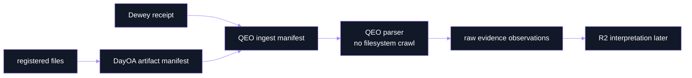
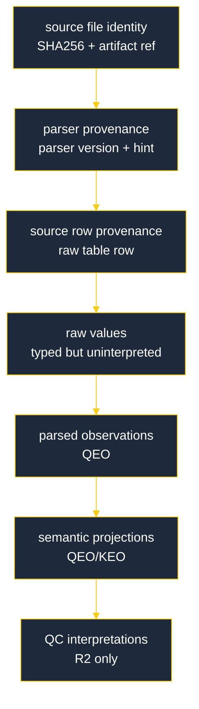

# QEO MultiQC Artifact Model

**MultiQC HTML is not canonical data.** It is an inspection report. Canonical evidence for QEO comes from registered files, stage manifests, parser-relevant data tables, and Dewey receipts.

## Artifact Classes

| Classification | Required | Parser relevant | Examples |
|---|---:|---:|---|
| `multiqc_html` | yes | yes | `DAY_final_multiqc.html` |
| `multiqc_data_json` | yes | yes | `DAY_final_multiqc_data/multiqc_data.json` |
| `multiqc_general_stats` | yes | yes | `DAY_final_multiqc_data/multiqc_general_stats.txt` |
| `multiqc_sources` | yes | yes | `DAY_final_multiqc_data/multiqc_sources.txt` |
| `multiqc_log` | yes | yes | `DAY_final_multiqc_data/multiqc.log` |
| `custom_mqc_tsv` | when produced | yes | `alignstats_combo_mqc.tsv`, `giab_sv_concordance_mqc.tsv` |
| `staging_manifest` | yes | yes | `reports/multiqc_inputs/final/manifest.tsv` |
| `benchmark` | when produced | no | `benchmarks_summary.tsv`, `rules_benchmark_data_mqc.tsv` |
| `log` | when produced | no | `reports/logs/all__mqc_fin_a.log` |
| `unknown` | no | no | Preserved but not parsed without a parser update. |

Unknown files are preserved in the artifact manifest. They are not a parser error unless a required file is missing.

## Parser Handoff

QEO receives:

- Dewey artifact refs,
- a DayOA artifact manifest,
- a Dewey receipt,
- parser hints,
- parser family,
- parser schema version,
- source manifest checksum,
- lineage refs.

QEO does not receive instructions to crawl the analysis filesystem.

## Why `_mqc.tsv` Matters

DayOA custom `_mqc.tsv` files are strategically important because they preserve row-shaped evidence before MultiQC presentation transforms it. Examples:

- `input_sample_libraries_mqc.tsv`: loaded `samples.tsv` and `units.tsv` rows joined by sample and analysis unit.
- `alignment_qc_outputs_mqc.tsv`: alignment QC output inventory.
- `contamination_mqc.tsv`: contamination evidence without pass/fail authority.
- `bcftools_variant_stats_mqc.tsv` and `rtg_vcfstats_mqc.tsv`: variant statistics evidence.
- `giab_sv_concordance_mqc.tsv`: GIAB structural-variant benchmark evidence.
- `rules_benchmark_data_mqc.tsv`: workflow resource evidence.

These files should be registered as individual key artifacts, not only as part of a directory.

## Required Semantic Separation

Do not flatten source rows into QC truth during registration or QEO ingestion.

