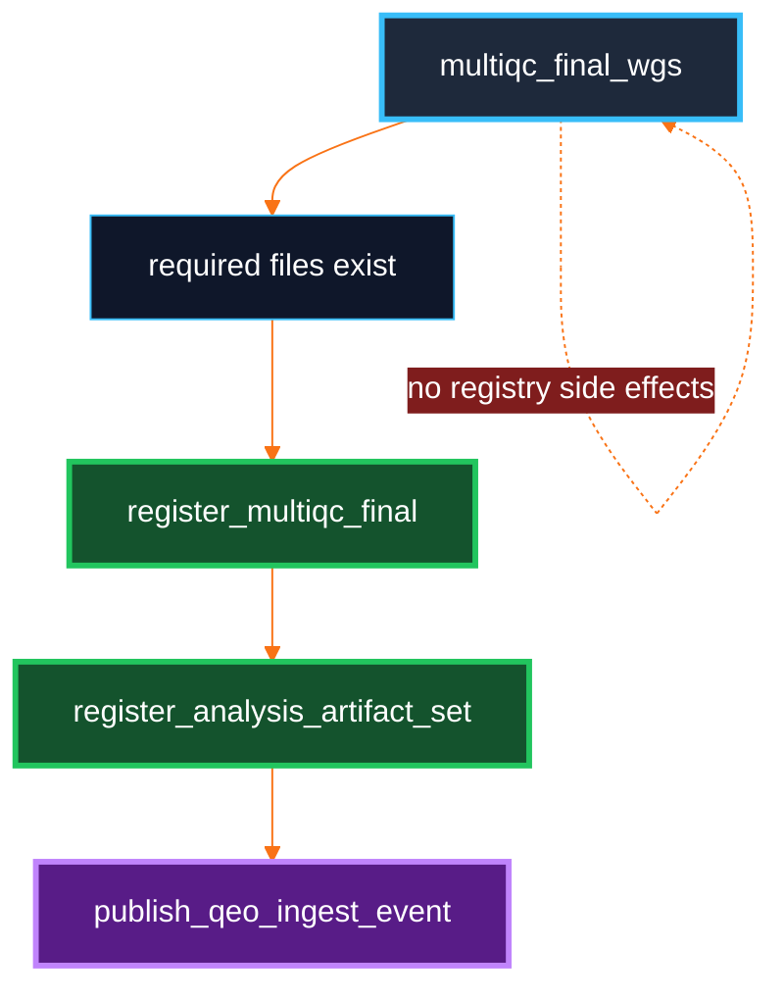

# QEO Snakemake 7 Registration Rules

**Registration is a DAG edge, not a watcher.** The DayOA workflow registers evidence after the evidence exists and before QEO ingest is advertised.

## Rules

| Rule | Inputs | Outputs |
|---|---|---|
| `register_multiqc_final` | `DAY_final_multiqc.html`, `DAY_final_multiqc_data/` required files, final stage manifest, parser-relevant `_mqc.tsv` and benchmark files. | Final MultiQC artifact manifest, Dewey receipt, QEO manifest. |
| `register_analysis_artifact_set` | MultiQC registration outputs, final report files, logs, benchmark files, stage manifest. | Analysis artifact-set manifest, Dewey receipt, QEO ingest manifest. |
| `publish_qeo_ingest_event` | Analysis artifact-set manifest and receipt. | Replay-safe outbox event JSON. |

Target aliases:

```bash
dy-r produce_qeo_multiqc_registration -p -j 1
dy-r produce_qeo_analysis_artifact_set -p -j 1
dy-r produce_qeo_ingest_event -p -j 1
```

## Why Registration Is After MultiQC

MultiQC generation is artifact generation only. It must remain free of Dewey side effects so reruns, dry-runs, retries, and report debugging stay normal Snakemake operations.



## Required Files

`register_multiqc_final` fails if any of these are missing:

- `results/day/<build>/reports/DAY_final_multiqc.html`
- `results/day/<build>/reports/DAY_final_multiqc_data/multiqc_data.json`
- `results/day/<build>/reports/DAY_final_multiqc_data/multiqc_general_stats.txt`
- `results/day/<build>/reports/DAY_final_multiqc_data/multiqc_sources.txt`
- `results/day/<build>/reports/DAY_final_multiqc_data/multiqc.log`
- `results/day/<build>/reports/multiqc_inputs/final/manifest.tsv`

## Worked Local-Only Example

```bash
eval "$(conda shell.zsh hook)" && conda activate DAY-EC
source dyoainit
dy-a local hg38
dy-r produce_multiqc_all -p -j 1
dy-r produce_qeo_multiqc_registration -p -j 1
dy-r produce_qeo_analysis_artifact_set -p -j 1
dy-r produce_qeo_ingest_event -p -j 1
```

This requires explicit `qeo_registration` config. If the config is absent, the registration rules fail with a clear error instead of guessing.

## Worked Dewey Example

```bash
export DEWEY_BEARER_TOKEN=<token>
source dyoainit
dy-a slurm hg38
dy-r produce_qeo_analysis_artifact_set -p -j 1
```

The config must include a literal `s3://...` `storage_root_uri`. Dewey mode registers:

- the root analysis directory as a prefix artifact,
- the MultiQC data directory as a prefix artifact,
- individual key files such as HTML, `multiqc_data.json`, `multiqc_general_stats.txt`, `multiqc_sources.txt`, `multiqc.log`, custom `_mqc.tsv`, stage manifests, and parser-relevant tables,
- an artifact set that QEO can ingest by receipt and manifest.

## Failure Modes

| Failure | Expected behavior |
|---|---|
| Missing `qeo_registration.mode` | Fail before writing registration outputs. |
| Missing required MultiQC file | Fail with the exact missing file path. |
| Dewey mode without token or URL | Fail before HTTP calls. |
| Dewey mode without `s3://` storage root | Fail before HTTP calls. |
| Duplicate parser sample names | Preserve warning in manifest; staging remains responsible for hard collision failures. |

